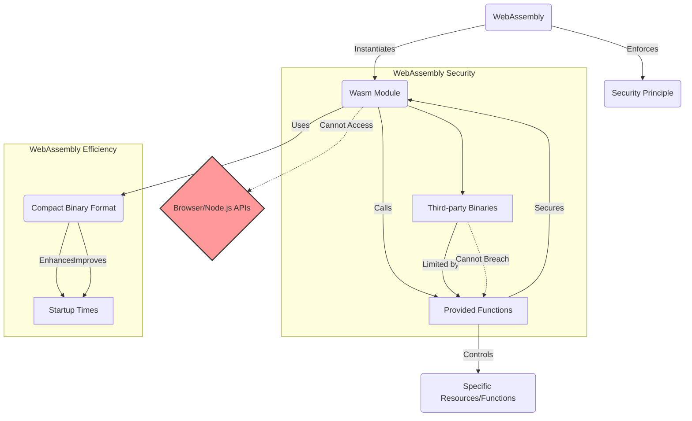
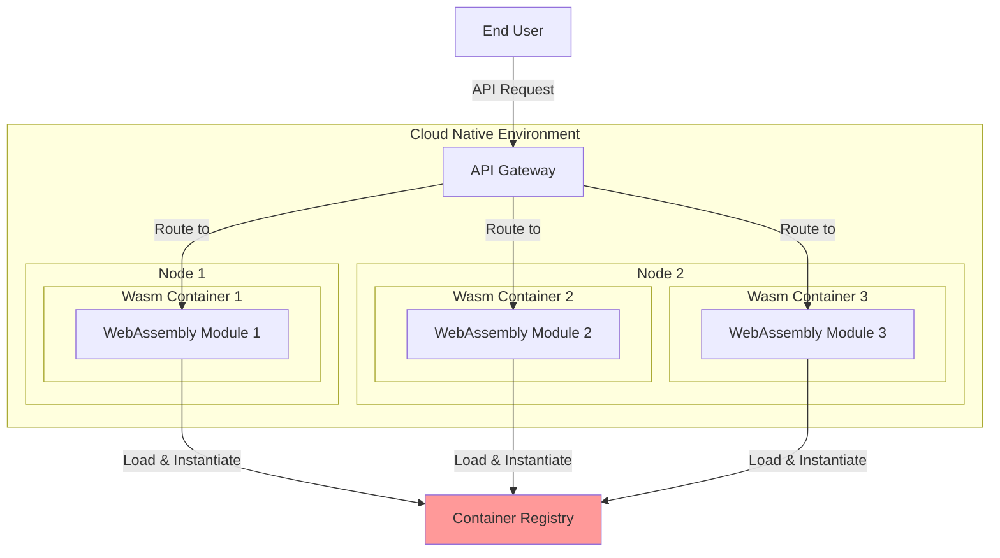
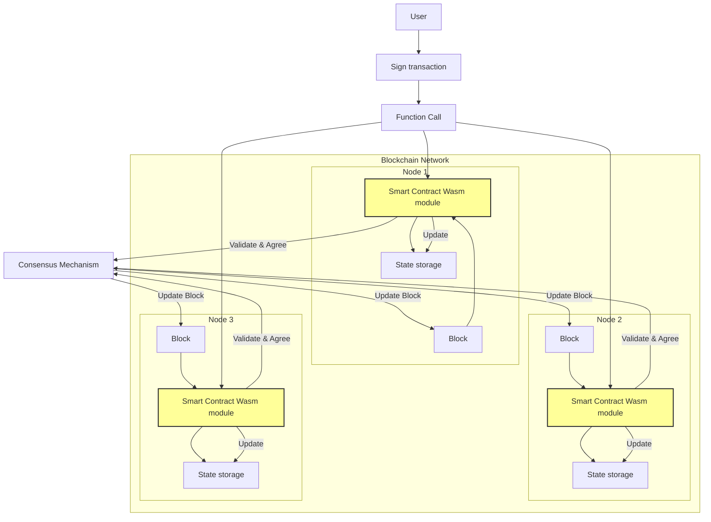
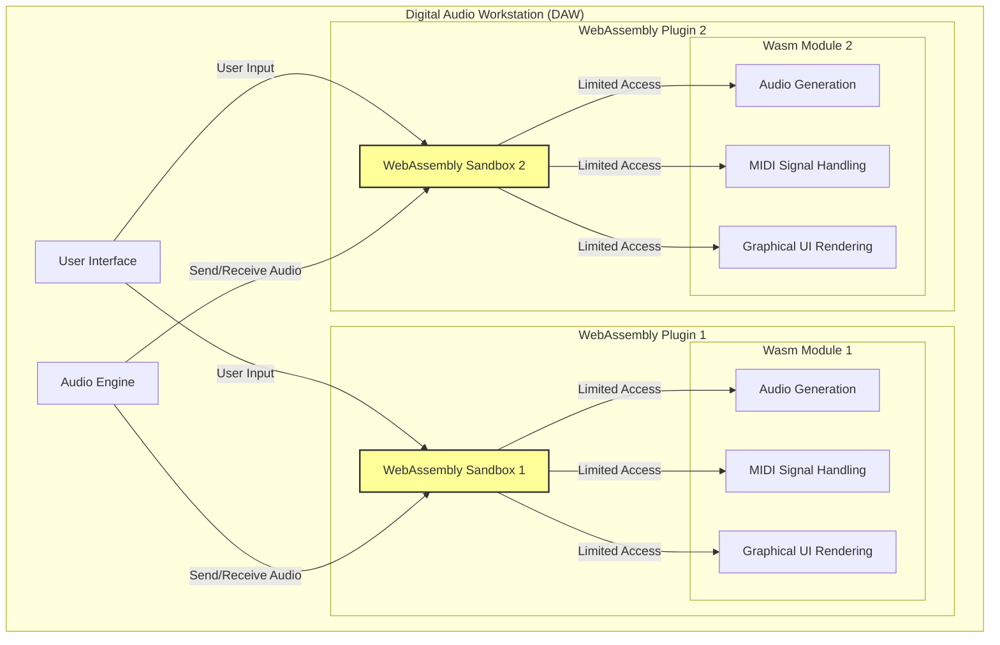

# Why WebAssembly

The Web is amazing. Not only have we been able to be served content from all over the world, but we can interact with it. From everything to ordering our daily goods, to playing games, and even be productive in our everyday jobs. Whether it means working in documents or spreadsheets, programming, working with illustrations and photo or even video editing, or with complex technical drawings. However the latter has only been possible since WebAssembly was released in 2017. Well, not entirely true because it was even possible before through a special subset of Javascript called `asm.js`. This special, limited way, of writing javascript could be  directly translated to machine code. CPU instructions that require no further optimization or interpretation, but can run at full native speed.

## asm.js vs WebAssembly

Let's have a look at some `asm.js` code:

```javascript
function Adder() {
    "use asm";

    function add(a, b) {
        a = a | 0;
        b = b | 0;
        return (a + b) | 0;
    }

    return {
        add: add
    };
}
const adder = new Adder();
console.log(adder.add(3,5));
```

Notice the `"use asm";` directive and the bitwise `or` operator used to ensure the input parameters can be trusted as signed int32 numbers. This way the compiler can avoid dynamic type checking that is normally done in Javascript, and then we have fully optimized code for adding numbers, just as it would come out of a `C` compiler, or even from direct Assembly code.

Why wasn't this good enough? asm.js was still quite verbose javascript, not as compact as binary code can be, and the concept of a secure sandbox that WebAssembly runs in was not established. WebAssembly took the ideas of asm.js to build a new universal binary format, that translates directly to machine code on whatever CPU that is under the hood. It runs in a secure sandbox, with only the capabilities that you give to it, and it runs fast. There are cases where you might even see that WebAssembly runs faster than hand-written assembly code that is written for broad, backwards compatibility, because WebAssembly can be translated to machine code optimized for the CPU it runs on there and then. For example hand written assembly code, or even compiled C code, might have been written to support old versions of x86 processors, using the x87 instruction set for math operations. Modern x86 processors though will have SSE which is generally faster, and a WebAssembly runtime may choose to use these instructions instead, if running on a modern processor. Obtaining the same with hand-written assembly would require re-writing, and for C it would require re-compilation. Maybe you would get better results for a specific platform that way, but with WebAssembly it's possible to distribute a binary that has generally good optimization possibilities across many platforms.

So let's see how the same example above would look like in WebAssembly. I did mention Assembler, which is typically a more readable version of machine code. Machine code is just a series of numbers that represent instructions and parameter values, while in order to edit and read it, it always good to put a name on those instructions. Every microprocessor, has a corresponding text version of the machine code, that we call the Assembly language for that processor, and WebAssembly also has a text format. Here's what the `add` function above looks like in WebAssembly Text Format ( `wat` ).

```wat
(module
  (func $add (param $a i32) (param $b i32) (result i32)
    local.get $a
    local.get $b
    i32.add)
  (export "add" (func $add))
)
```

and by "assembling" this to WebAssembly binary, we'll get this series of bytes:

```
0, 97, 115, 109, 1, 0, 0, 0, 1, 7,
1, 96, 2, 127, 127, 1, 127, 3, 2, 1,
0, 7, 7, 1, 3, 97, 100, 100, 0, 0,
10, 9, 1, 7, 0, 32, 0, 32, 1, 106,
11
```

You can already now see that this is much more compact than the `asm.js` version above. Even just a compact version of the add function in asm.js: `function add(a,b){a=a|0;b=b|0;return (a + b)|0;}`, is more than the 41 bytes of WebAssembly that also includes information about the function to export.

If you've been into programming since the 80s like me, you maybe remember computer magazines listing page after page with numbers like these. By typing these into your Commodore 64, you could actually get a little game running on your computer. What you typed was the machine code containing all the instructions and data for this game, and the entry point for this was a command from the C64 BASIC called `SYSTEM`, that would simply point the CPU to the memory location of these numbers that you've typed and run the program. 

It's the same feeling with WebAssembly. You load these numbers into your Javascript runtime, and then you can call the functions that your WebAssembly module "exports". Since WebAssembly code resembles the typical instructions in CPU machine code, it translates easily to the machine code of the actual CPU in your device. So even if it's not the actual machine code, it still brings us back to the basics. We can ship a program in the form of a series of numbers, load it into the web-browser and run it. But this time it's portable to a wide range of devices, and much more secure.

Let's try loading those numbers into Javascript and call the add function:

```javascript
const wasmbytes = new Uint8Array([
    0, 97, 115, 109, 1, 0, 0, 0, 1, 7,
    1, 96, 2, 127, 127, 1, 127, 3, 2, 1,
    0, 7, 7, 1, 3, 97, 100, 100, 0, 0,
    10, 9, 1, 7, 0, 32, 0, 32, 1, 106,
    11
]);
const adder = await WebAssembly.instantiate(wasmbytes,{}).then(mod => mod.instance.exports);
console.log(adder.add(3,5));
```

As you can see the series of numbers contains a little function library that we can call from Javascript. This function library runs at full speed in the CPU of your device and also in a secure context where it has no way to tamper outside its boundaries. 

Let's also revisit what I said above about assembly written or compiled to support legacy CPUs, or maybe even the reason for using older instructions might also be just because they take less space. Let's take the example of adding above, but add floats instead of integers:

```wat
(module
  (func $add (param $a f32) (param $b f32) (result f32)
    local.get $a
    local.get $b
    f32.add)
  (export "add" (func $add))
)
```

A WebAssembly runtime could translate the floating point addition to an SSE instruction like `addss xmm0, xmm1` which is 4 bytes, while the hand-written/pre-compiled assembly might be `fadd st(1)` which is only 2 bytes, and the intention might have been to optimize for size. In WebAssembly the `f32.add` instruction is just one byte, meaning you'll get the best of both worlds. You'll have a compact binary, and at runtime, it translates to the optimal instructions. Note that this is a specific example, and the efficiency gains will vary based on the operation, the architecture, and other factors. The key point is that WebAssembly can, in some situations, provide a compact representation that translates to efficient machine code, potentially outperforming handwritten or precompiled assembly.

WebAssembly is different than Just-In-Time compiled languages like C# and Java, since it is made for completely translating directly to machine code before it runs. This is called Ahead-Of-Time (AOT) compilation. C# and Java can become very fast over time after "warming up", sometimes faster than AOT compiled code, by optimizing itself through the execution time, while WebAssembly offers predictable performance from the moment it starts. And it also starts very fast. For sure, in recent years, AOT compilation has become avialable for C# and Java too, but the footprint is much larger, and must also handle mechanisms such as the Garbage Collector. Also, while many programming languages, including C# and Java, includes system access features for the file system, network and more, WebAssembly has nothing but memory and instructions. By default it really can't interact outside its sandbox at all, and that what's makes it so secure. So two of the keywords for WebAssembly is security and predictable performance.

## Plugin technologies

Then what about Java applets, Flash plugins and Silverlight? All of these were technologies that powered the web to serve advanced interactive content. In the beginning of the web, the only way to draw single pixels in a page was by using Java applets. Also using applets, was in many cases the only way to create a user experience without reloading the page for every interaction. But Java applets were not a web standard, it was a plugin that needed a separate installation and updates. Then came Flash, also a plugin, but enabling good looking and enhanced interactive user experiences, and also attractive to many frontend developers and designers. Microsoft also came with Silverlight to bring C# to the web. At the time these plugin technologies were introduced, they offered the possiblity to create much richer and smoother user experiences than what was offered by the browser without these plugins.

At the same time the capabilities of the standards-based technologies like Javascript, HTML and CSS were evolving. But even with increasingly improving built-in support in the standard browser technologies to make server requests without reloading the page, and drawing pixels in a canvas, without any plugins, the plugin technologies were still popular. Especially Flash, which was bundled with many browsers. A turning point came when Apple announced that Flash would not be supported on iOS devices, criticizing performance and power usage, and that it wasn't really made for touch devices. From this point on, web developers knew that in order for web apps to run on these new mobile devices, they would have to make the most out of Javascript and HTML. And web browsers already had much of what was needed. Now it was about to improve it, introducing asm.js for code execution at native speed, and then also setting the stage for WebAssembly.

Over time, support for these plugin technologies ended also for desktop based browsers. But actually it also turns out that runtimes for Flash, Silverlight and Java can be implemented in WebAssembly, and that way enable reuse of applications built on these technologies. Since WebAssembly is a compilation target, just as any other operating system and CPU, these legacy plugin technologies can also be compiled to WebAssembly. As tremendeous investments has been made into developing applications on these technologies, still being able to serve them in the web browser is of substantial value to businesses, saving time and resources on reimplementing for new technologies.

## Preserving legacy

Also interesting is the possibility to port desktop applications to the web browser. Legacy desktop applications, can with some effort be adjusted to run in the browser. Traditional desktop UI libraries, now also come with a Wasm version. There are even full machine emulators, running software from the whole history of home and personal computers. This is also in particular interesting for businesses, enabling them to still run legacy software, and also profit on the enhanced security features that WebAssembly has to offer. Serving a legacy desktop app from a web browser can be combined with modern multi factor authentication on the web. Network traffic can be secured over HTTPS, solving a number of security issues that prevents much legacy software from living up to modern security standards.

## Writing new applications

So since it's possible to write WebAssembly applications using legacy technologies, or even write modern C# or Java apps targeting WebAssembly, should you choose this for new apps? You might have invested a lot into learning for example C# and maybe also you want to reuse existing C# code. Also reusing libraries both server side and client side might be beneficial in some cases. For example input validation features in a Web Application, where the input should be validated in the frontend without asking the server to provide instant feedback to the user, and then also a better user experience. Still you need that same validation on the server, to ensure that the data passed is valid, and so using the same code both in the backend and frontend makes sense.

While reusing the same code both on the server and in the browser might seem appealing, there are other considerations to be made as well. For example C# would add a larger footprint, in terms of codesize of the application itself, but also since it involves having a .NET runtime running in Wasm. The same application in Javascript would be much more efficient, both in size and performance, and you can run Javascript both in the browser and on the server, and then also reuse code. So given that, just because we have WebAssembly, doesn't necessarily mean that we should stop using Javascript.

## Compiling C/C++ to asm.js and WebAssembly

Emscripten ( https://emscripten.org ) is a complete compiler toolchain to WebAssembly. Before WebAssembly it could be used for compiling to asm.js. In 2013 I started to write a chart web application for technical analysis of stock market shares, and found the need for a library providing technical indicators like moving averages, stochastic, bollinger bands and more. There were not many Javascript libraries around, but I found a library called TA-lib ( https://github.com/TA-Lib/ta-lib ) written in C that also had been used by Linux Desktop applications, but not on the web. I wondered if this could be used in the browser by compiling it to asm.js using Emscripten, and that turned out to work fine.

However there is no straight forward recipie for compiling any C or C++ library to asm.js or WebAssembly. Every library have differences when it comes to compiler toolchain, operating system bindings, feature flags etc. So in most cases you must invest quite a bit of time to make it work, but still it's more efficient than re-writing to Javascript.

Let's have a look at how it was to compile TA-lib.

The first is to clone the TA-lib repository from https://github.com/TA-Lib/ta-lib

Secondly, we need to configure the project. For TA-lib the `configure` script is generated by `autogen.sh` which is found in the root of the repository. We can then use the emscripten toolchain to build the TA-lib static library.

This part is quite straight-forward and resembles the common way of building with C:

```
emconfigure ./configure
emmake make
```

The difference here from normal `./configure` and `make` is that we use `emconfigure` and `emmake` which are specific to emscripten.

After this we can find the static library `src/.libs/libta_lib.a` which we can link to for exporting functions to a asm.js or WebAssembly build.

Let's start with the asm.js build and expose one function for calculating a standard moving average: `_TA_SMA`

`emcc  -s EXPORTED_FUNCTIONS='["_malloc","_TA_SMA"]' -sWASM=0 src/.libs/libta_lib.a -o ta-lib.asm.js`

Now using this from Javascript would not be like using functions from a normal JS library. Consuming functions from a native library, involves allocating memory and sending pointers for parameters, either if the library is written in C/C++, machine code, assembly language, Rust or any other low level language. Note that we also exposed `_malloc` here, which is because we also need to allocate memory for the input and output data, as well as the returned values for `outBegIdx` and `outNBElement`. 

Let's look at how the `TA_SMA` function is defined in the `ta_func.h` include file from TA-lib:

```
TA_LIB_API TA_RetCode TA_SMA(
                int    startIdx,
                int    endIdx,
                const double inReal[],
                int           optInTimePeriod, // From 2 to 100000
                int          *outBegIdx,
                int          *outNBElement,
                double        outReal[] );
```

The first two parameters are integers, and these we can pass directly from Javascript. However the array on the third parameter will be passed as pointer to a location in memory, or the `HEAP` which is the term for memory that is changed during the applications lifetime. In our case we will allocate the memory for `inReal`. `_malloc` will return a number, which represents the location in memory, and that is the pointer that we can send into this third parameter of `TA_SMA`.

Our complete nodejs Javascript code for initializing TA-lib, allocating memory for the input and output data, and the return values, as well as filling the input data values, could look like this:

```
var talib = require('./ta-lib.asm.js');
talib.onRuntimeInitialized = function() {
    var numElements = 16;
    var inReal = talib._malloc(8 * numElements);

    var outBegNdx = talib._malloc(4);

    var outNBElement = talib._malloc(4);
    var outReal = talib._malloc(8 * numElements);

    var inBuffer = new Float64Array(talib['HEAPF64'].buffer, inReal, numElements);

    for (let n = 0; n < numElements; n++) {
        inBuffer[n] = n + 0.5;
    }

    talib._TA_SMA(1, numElements - 1, inReal, 2, outBegNdx, outNBElement, outReal);

    var outBuffer = new Float64Array(talib['HEAPF64'].buffer, outReal, numElements - 1);
    console.log(outBuffer);
};
```

As you can see we are setting up an input buffer with 16 numbers, and filling it with values from 0.5 and increasing up to 15.5. A `double` is a 64 bit float, which is then 8 byte, and so we also have to allocate `8 * numElements` bytes for the input data ( `inReal` ). The `outBegNdx` and `outNBElement` return values are both 32 bit integers, and so we only allocate 4 bytes for each of them. For the output buffer there will be 15 values, since we are calculating a moving average on 2 values at the time.

The input buffer looks like this:

```
Float64Array(16) [
   0.5,  1.5,  2.5,  3.5,
   4.5,  5.5,  6.5,  7.5,
   8.5,  9.5, 10.5, 11.5,
  12.5, 13.5, 14.5, 15.5
]
```

And a moving average of 2 values would be `(0.5 + 1.5) / 2 = 1` for the first two values, `(1.5 + 2.5) / 2 = 2` for the second and the third value, `(2.5 + 3.5) / 2 = 3` for the third and fourth value, and so it goes..

The full output will be like this:

```
Float64Array(15) [
   1,  2,  3,  4,  5,  6,
   7,  8,  9, 10, 11, 12,
  13, 14, 15
]
```

which we can see is the moving average with the period of 2 values.

Note that this was the `asm.js` version, with no WebAssembly involved yet. It's all only Javascript, even though it's compiled from C. If we take a look at the compiled `ta-lib.asm.js`, we can see javascript code like below as part of the implementation of the `TA_SMA` function. It's not very human readable, but it's optimal Javascript for translating directly to machine code.

```
   label$6 : while (1) {
    $12_1 = +HEAPF64[($2 + ($7_1 << 3 | 0) | 0) >> 3];
    $10_1 = $10_1 + +HEAPF64[($2 + ($0_1 << 3 | 0) | 0) >> 3];
    HEAPF64[($6_1 + ($3 << 3 | 0) | 0) >> 3] = $10_1 / $11_1;
    $10_1 = $10_1 - $12_1;
    $7_1 = $7_1 + 1 | 0;
    $0_1 = $0_1 + 1 | 0;
    $3 = $3 + 1 | 0;
    if (($3 | 0) != ($1_1 | 0)) {
     continue label$6
    }
    break label$6;
   };
```

If we turn on the WebAssembly switch, by removing the `-sWASM=0` parameter from the compiler arguments

`emcc  -s EXPORTED_FUNCTIONS='["_malloc","_TA_SMA"]' src/.libs/libta_lib.a -o ta-lib.js`

We'll now get two output files `ta-lib.js` and `ta-lib.wasm`.

Let's also change the first line of our nodejs program above to use the new output file:

`var talib = require('./ta-lib.js');`

We get the exact same result from the program, but it's now using the WebAssembly file, which if we "disassemble" to text format, has contents like this for the `TA_SMA` function:

```
(func $TA_SMA (type $t4) (param $p0 i32) (param $p1 i32) (param $p2 i32) (param $p3 i32) (param $p4 i32) (param $p5 i32) (param $p6 i32) (result i32)
    (local $l7 i32) (local $l8 i32) (local $l9 i32) (local $l10 f64) (local $l11 f64) (local $l12 f64)
    block $B0
      local.get $p0
      i32.const 0
      i32.ge_s
      br_if $B0
      i32.const 12
      return
    end
    i32.const 13
    local.set $l7
    block $B1
      local.get $p1
      i32.const 0
      i32.lt_s      
```

Again we can see that WebAssembly is a natural evolution of asm.js, providing a compact binary format for the compiled C code.

Actually, even though emscripten emits a helper Javascript file ( `ta-lib.js` ) along with the `ta-lib.wasm` file, we could actually use the `.wasm` file directly. This is because in this particular case we are not using things like file system and other operating emulation functionality that the javascript file emitted from emscripten provides. We are only calculating numbers in memory and then we could provide that memory ourselves.

Let's see how we can use it without the `ta-lib.js` file:

```
var fs = require('fs');
WebAssembly.instantiate(fs.readFileSync('./ta-lib.wasm'),
    {
        env: {
            emscripten_resize_heap: function () { }
        }
    }).then(function (mod) {

        var talib = mod.instance.exports;

        var numElements = 16;
        var inReal = talib.malloc(8 * numElements);

        var outBegNdx = talib.malloc(4);

        var outNBElement = talib.malloc(4);
        var outReal = talib.malloc(8 * numElements);

        var inBuffer = new Float64Array(talib.memory.buffer, inReal, numElements);

        for (let n = 0; n < numElements; n++) {
            inBuffer[n] = n + 0.5;
        }

        talib.TA_SMA(1, numElements - 1, inReal, 2, outBegNdx, outNBElement, outReal);
        var outBuffer = new Float64Array(talib.memory.buffer, outReal, numElements - 1);
        console.log(outBuffer);
    });
```

The output of this program is exactly the same as the previous, but what just happened here? Now we used the `WebAssembly.instantiate` function of the Javascript VM ( which is called `V8` for nodejs ). We can instantiate WebAssembly modules directly from `.wasm` files this way. Also note that we had to provide some environment function called `emscripten_resize_heap`, but now we just mock this, since we know that it won't be used for just allocating the 136 bytes we need for the input/output buffers and return values. We can access the memory buffer directly from the WebAssembly instance object, and so we can also manipulate and inspect the contents of the memory of the Wasm module. By skipping the `ta-lib.js` file emitted from Emscripten we reduce the total file size significantly, since this javascript file is quite a bit larger than the Wasm file.

## Security sandbox, compact binary, and fast startup times

Since the WebAssembly binary code is instantiated with the `WebAssembly.instantiate` function, which is providing a "sandbox" where we specify the Wasm module imports, we are also in full control of what this Wasm module is able to access. In the example above we provide the empty function `emscripten_resize_heap`, which is empty, and so if the WebAssembly code calls this, nothing happens at all. The WebAssembly module is not able to call any other Javascript function, nor any nodejs or browser API, unless we specify it in the imports. This is a notable improvement over asm.js where the output still was Javascript and could also call to any javascript function in the runtime environment. WebAssembly thereby can enhance security when accepting binaries from users and third parties since they cannot access resources beyond those granted through the imports. This approach paves the way for increased flexibility while maintaining security when distributing Wasm modules for use as plugins or addons to a host application. 

But of course, as pointed out by Lin Clark at the first WebAssembly Summit in 2020, it's important that the future evolution of WebAssembly does not add features that breaks this security principle. Right now, this makes it stand out from the Java Virtual Machine or .NET runtime, as WebAssembly does not inherently expose any system access or capabilities. Nonetheless, it is imperative to approach the execution of third-party binaries with caution and a robust security strategy, ensuring that provided functions cannot be manipulated maliciously and that binaries are rigorously vetted.

The compact binary format of WebAssembly also improves startup time, both in the way that the download size is smaller, and that it can instantiate while streaming, and also since the binary format is close to machine code. This is an advantage, not just for the Web, but also on the server.



## WebAssembly beyond the web

When comparing Docker containers, Java `.jar` files or .Net assemblies, WebAssembly modules offer compact, secure and performant modules with low footprint that fits well into a server hosting environment. Especially in the cloud native world, where it is a viable container distribution format, but also for Edge and function app hosting, where the small size and fast startup times of the WebAssembly binaries makes it possible to load and cold start when the request comes in.



Blockchain is another interesting use case for WebAssembly. Modern blockchains have the concept of "smart contracts" which are small programs connected to each account, offering custom functionality to be executed as in a transaction, or just for looking up data. WebAssembly smart contracts offer the possibility to write them in the language of choice. Smart contracts in a blockchain also run on decentralized, independent nodes, and so it is a necessity that the smart contract code, which should be considered as 3rd party untrusted code, runs in a secure sandbox, which is the case for WebAssembly. NEAR protocol is an example of a blockchain with WebAssembly smart contracts, and the capabilities exposed are limited to the blockchain specific interfaces, and not giving access to the system of the host node.



Then there are applications that hosts user supplied and 3rd party extensions. One example is a Digital Audio Workstation (DAW) where you today have the concept of "plugins" for virtual instruments and effect. These are applications hosted inside the DAW, and today they have full access to the system, while if applying a WebAssembly runtime for the host, the capabilities exposed to the plugins could be limited to generating audio, receiving midi signals, and also providing a graphical user interface.



For all of these use cases, there are WebAssembly runtimes that does not need a Javascript host environment to run the WebAssembly module. WebAssembly modules can even be started from within Java or C#, Rust or C, using language bindings from e.g. the Wasmtime WebAssembly runtime. There are also many other runtimes and interpreters for all kinds of environments and devices. The WebAssembly ecosystem is expanding beyond the web.