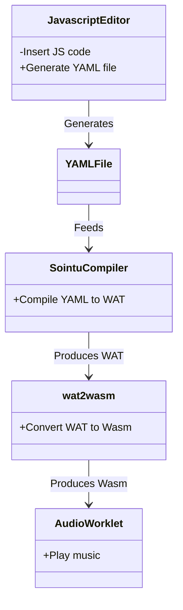

WebAssembly from scratch
========================

In this chapter we'll dive straight into the bits and bytes of WebAssembly. We'll look at the WebAssembly Text format which is the text representation of the codes we see in a Wasm binary. While it is indeed possible to write full WebAssembly programs on this low level, I don't intend to encourage or teach you how to do that. Writing assembly code requires patience, and you also need to memorize the instructions in order to be efficient and write code that performs. Still, to take fully advantage of WebAssembly, it's important to understand, be able to debug and manipulate WebAssembly binaries. And compared to Assembly on the CPU level, WebAssembly is quite more accessible. It's the same on all platforms, in the browser or server-side. The selection of tools are growing, and inspection and debugging is accessible directly in the browser.

## Briefly about WebAssembly binaries and the WebAssembly Text format

Consider the hex output of the `add.wasm` file, provided by `hexdump -C add.wasm`:

```
00000000  00 61 73 6d 01 00 00 00  01 07 01 60 02 7f 7f 01  |.asm.......`....|
00000010  7f 03 02 01 00 07 07 01  03 61 64 64 00 00 0a 09  |.........add....|
00000020  01 07 00 20 00 20 01 6a  0b                       |... . .j.|
```

Let's "disassemble" this using `wasm-objdump` which is a tool in the "WebAssembly Binary Toolkit", aka WABT: https://github.com/WebAssembly/wabt

`wasm-objdump -shdx add.wasm`

```
add.wasm:       file format wasm 0x1

Sections:

     Type start=0x0000000a end=0x00000011 (size=0x00000007) count: 1
 Function start=0x00000013 end=0x00000015 (size=0x00000002) count: 1
   Export start=0x00000017 end=0x0000001e (size=0x00000007) count: 1
     Code start=0x00000020 end=0x00000029 (size=0x00000009) count: 1

Section Details:

Type[1]:
 - type[0] (i32, i32) -> i32
Function[1]:
 - func[0] sig=0 <add>
Export[1]:
 - func[0] <add> -> "add"
Code[1]:
 - func[0] size=7 <add>

Code Disassembly:

000022 func[0] <add>:
 000023: 20 00                      | local.get 0
 000025: 20 01                      | local.get 1
 000027: 6a                         | i32.add
 000028: 0b                         | end

Contents of section Type:
000000a: 0160 027f 7f01 7f                        .`.....

Contents of section Function:
0000013: 0100                                     ..

Contents of section Export:
0000017: 0103 6164 6400 00                        ..add..

Contents of section Code:
0000020: 0107 0020 0020 016a 0b                   ... . .j.
```

Now this tells us quite a bit about the contents of the Wasm binary file. We see that the code part is just a small piece of it. First there is the "magic number" with the contents `\0asm` identifying that it's a Wasm file. Then there is the version `0x01 0x00 0x00 0x00`.

The following parts are sections that starts with what section type it is, the length, and then the contents of the section. From the output above we see that there is a `Type` section, which defines the signature used by the function in the next section. The actual `Code` has a dedicated section, and there's also a section for `Export`, where also the name to be used by Javascript for invoking the function is defined.

Why do we need to know about this? What's the need for diving into this low level of binary code in everyday, practical use of WebAssembly? And for sure we can compile to WebAssembly from many languages, so why would we want to learn about the binary format or even the WebAssembly Text format (wat)?

## Running Javascript inside WebAssembly

While in most use cases, it would not be practical to write WebAssembly Text format by hand, and certainly not binary codes, being able to manipulate WebAssembly binaries or generate them at runtime have many practical use cases. For example you may want to run a javascript engine inside WebAssembly, because you want to write a smart contract in Javascript. However exporting functions from javascript does not out of the box export them through the WebAssembly binary. We could recompile the whole Javascript engine with the exports from the Javascript we want to embed, but that would be a heavy build process that require a full toolchain installed on the computer of a developer that is only interested in writing Javascript. An approach that gives a better experience for the Javascript developer is then to manipulate the the script engine Wasm module on the fly and add exports according to the exported functions of the embedded Javascript. We could then even provide a Javascript editor in a web browser, and generate Wasm modules there as well, without any server involved. In order to do that we need to understand how the WebAssembly module is built, so that we can add extra exports and function implementations.

So what does this actually look like? We are going to cover this more deeply in a later chapter, but I will show you here what we want to obtain and why it makes sense to manipulate WebAssembly code here.

In this example we are writing a smart contract for NEAR protocol in Javascript. NEAR protocol smart contracts are WebAssembly binaries, so in order to use Javascript we need a JS runtime inside WebAssembly. It's not just for smart contracts it is beneficial to run JS inside Wasm. Also in cases where you accept user supplied javascript code, and you want to run it inside a secure sandbox, without access to all Javascript nodejs or browser APIs, running it inside WebAssembly provides that sandboxing.

The example is taken from https://github.com/petersalomonsen/quickjs-rust-near which was my response to a challenge on combining Rust and Javascript into a NEAR protocol smart contract. QuickJS, written by Fabrice Bellard ( https://bellard.org ), is a small, embeddable and complete Javascript engine written in C. It also comes with a compiler that creates a bytecode representation of Javascript, which is also what the QuickJS runtime interprets when executing scripts. It's quite easy to compile QuickJS to WebAssembly, I have a project for that too which you can find at https://github.com/petersalomonsen/quickjs-wasm-near, but I will write more about that in chapter 8. There I will also show you the challenges of embedding it into Rust and compiling it all to WebAssembly. In this chapter I will focus on how we can manipulate the resulting Wasm binary to embed different Javascript without recompiling everything. 

Below is a simple Javascript smart contract with two methods that we want to export: `hello` and `add`. It uses the `env` that is provided by the NEAR protocol smart contract runtime, through WebAssembly imports, where we have access to input variables, and we can also return a value.

```javascript
export function hello() {
    const name = JSON.parse(env.input()).name;
    env.value_return('hello ' + name);
}

export function add() {
    const input = JSON.parse(env.input());
    const result = (input.a + input.b);
    env.value_return(JSON.stringify({result}));
}
```

So the challenge is now that we want to be able to write smart contracts in Javascript without having to also recompile the whole C and Rust code that embeds the Javascript runtime. Also we know that adding multiple exported functions to the Javascript does not add the same exports to the WebAssembly binary. After all the exports we would want to see in the Wasm binary are these:

```
  (export "hello" (func $hello.command_export))
  (export "add" (func $add.command_export))
```

In Rust, exporting the two functions, initializing the JS runtime and invoking Javascript would look like this:

```Rust
impl Contract {
    pub fn hello(&self) {
        let jsmod = load_js_bytecode(QUICKJS_BYTECODE.as_ptr(), QUICKJS_BYTECODE.len());

        unsafe {
            let function_name_cstr = CString::new("hello").unwrap();
            js_call_function(jsmod, function_name_cstr.as_ptr() as i32);
        }
    }

    pub fn add(&self) {
        let jsmod = load_js_bytecode(QUICKJS_BYTECODE.as_ptr(), QUICKJS_BYTECODE.len());

        unsafe {
            let function_name_cstr = CString::new("add").unwrap();
            js_call_function(jsmod, function_name_cstr.as_ptr() as i32);
        }
    }
}
```

But this means that the Rust code also has to know about the two exported Javascript functions, and we have to recompile everything when changing the Javascript. What if we rather could pre-compile a WebAssembly binary and manipulate that when we want a different Javascript code? And to make it a bit easier for ourselves, we'll use the WebAssembly Text format combined with the tools from WebAssembly Binary Toolkit.

So let's change our Rust code to something generic, with just one example Javascript invocation. Note that we also insert `123456789` for the pointer to the quickjs bytecode, and `456123987` for the function name string. This is so that we can do a simple search and replace when manipulating the `.wat` file later.

```Rust
impl Contract {
    pub fn some_js_function(&self) {
        unsafe {
            let jsmod = load_js_bytecode(123456789 as *const u8, 987654321);            
            js_call_function(jsmod, 456123987 as i32);
        }
    }
}
```

In the compiled WebAssembly we then see this export:

```
(export "some_js_function" (func $some_js_function.command_export))
```

and we also see a function implementation:

```
  (func $some_js_function (type 44)
    (local i32 i32 i32 i64)
```

These we can change and duplicate. If we use `wasm2wat` to convert the compiled wasm file to wat, we can alter the contents of that. So we can copy the functions with the names that refers to `some_js_function` and replace with functions according to the exported functions in our Javascript. While we could have manipulated the wasm file directly, the WebAssembly Text format is a bit easier to work with, and so we could also create a simple script that manipulates the wat for us.

Consider the script below, which first creates QuickJS bytecode out of the javascript we want to embed in the wasm binary. Then it reads the `.wat` file and finds the lines that belongs to `some_js_function`. It creates data sections for the function name strings and quickjs bytecode. Then copying lines belonging to 'some_js_function' and create new wasm functions that call into js, replacing pointers for function name string and QuickJS bytecode pointer. Finally assemble and write the modified `.wat` file.

```javascript
import { readFile, writeFile } from 'fs/promises';
import { createQuickJS } from './compiler/quickjs.js';

const quickjs = await createQuickJS();

// Compile quickjs bytecode

const quickjs_bytecode = quickjs.compileToByteCode(/*javascript*/`
export function hello() {
    const name = JSON.parse(env.input()).name;
    env.value_return('hello ' + name);
}

export function add() {
    const input = JSON.parse(env.input());
    const result = (input.a + input.b);
    env.value_return(JSON.stringify({result}));
}
`, 'contract.js');

const exported_functions = ['hello', 'add'];

let purejswat = (await readFile('./purejs.wat')).toString();

let purejswatlines = purejswat.split('\n');

let insideFunc = false;
const some_js_function_lines = [];
const some_js_function_lines_indices = [];
purejswatlines.forEach((line, ndx) => {
    // Detect lines in the .wat that belongs to 'some_js_function'
    const has_some_js_function = line.indexOf('some_js_function') >= 0;
    if (!insideFunc && has_some_js_function) {
        if (line.indexOf('(func') >= 0) {
            insideFunc = true;
        }
        some_js_function_lines.push(line);
        some_js_function_lines_indices.push(ndx);
        purejswatlines[ndx] = '';
    } else if (insideFunc) {
        if (line.indexOf('(func') >= 0) {
            insideFunc = false;
            return;
        }
        some_js_function_lines[some_js_function_lines.length - 1] += `\n${line}`;
        purejswatlines[ndx] = '';
    }
});

// create extra data sections for quickjs bytecode and the exported function name strings

const data_section_end = parseInt(process.argv[process.argv.length - 1].match(/end\=0x([0-9a-f]+)/)[1], 16);
const contractDataString = `(data $.quickjs_bytecode (i32.const ${data_section_end}) "${Array.from(quickjs_bytecode).map(c => '\\' + c.toString(16).padStart(2, '0')).join('')}")`;
const functionnamestringsstart = data_section_end + quickjs_bytecode.length;
const functionnamestrings = `(data $.function_names (i32.const ${functionnamestringsstart}) "${exported_functions.join('\\00')}\\00")`;

// copy lines belonging to 'some_js_function' and create new wasm functions that call into js,
// replacing pointers for function name string and quickjs bytecode pointer
let funcNamePosition = functionnamestringsstart;
exported_functions.forEach(funcName => {
    some_js_function_lines.forEach((val, ndx) => {
        purejswatlines[some_js_function_lines_indices[ndx]] += '\n' +
            val.replaceAll('some_js_function', funcName)
                .replaceAll('456123987', funcNamePosition)
                .replaceAll('123456789', data_section_end)
                .replaceAll('987654321', quickjs_bytecode.length);
    });
    funcNamePosition += funcName.length + 1;
});
// Assemble and write the modified .wat file

purejswat = purejswatlines.join('\n');
purejswat = purejswat.substring(0, purejswat.lastIndexOf(')')) + `\n${contractDataString}\n${functionnamestrings})\n`;
await writeFile('purejs.wat', purejswat);
```

Now we can create a `.wasm` file from that using `wat2wasm`. And finally we can call the resulting wasm binary, and we see that the methods we exported from the embedded javascript, now are also available directly on the WebAssembly instance.

```javascript
import { readFile } from 'fs/promises';
import { getContractInstanceExports } from '../../localjstestenv/contract-runner.js';

const { exports, nearenv } = await getContractInstanceExports(await readFile('./purejs.wasm'));
nearenv.set_args({ name: 'peter' });
exports.hello();
console.log(nearenv.latest_return_value);

nearenv.set_args({ a: 22, b: 23 });
exports.add();
console.log(nearenv.latest_return_value);
```

You can find the full sources to this in my github project: https://github.com/petersalomonsen/quickjs-rust-near/tree/master/examples/purejs#readme
This project, also known as "Js In Rust" is about providing the possibility to write smart contracts in Javascript, where the JS runtime QuickJS is running inside a Rust smart contract implementation compiled to WebAssembly. This combination offers the flexibility of Javascript, while still providing functionality from the NEAR Rust SDK.

## Writing WebAssembly Text format by hand

The next example is not really about how to write WebAssembly Text format by hand. Learning the instructions and how to structure such code is very much like programming assembly language for any CPU, and I will not provide a tutorial on that here. I will though show an example where this is done very well, and for a purpose, which is to create very tiny and efficient WebAssembly binaries. Even with full optimization features enabled from languages like C, Rust or even AssemblyScript, it's hard to get down to sizes like in the following example where the code is written directly in WebAssembly text format.

### Sointu, a modular synthesizer with hand-written WAT

Veikko Sariola (aka Pestis) created the Sointu project which you can find at https://github.com/vsariola/sointu. It's a fork of 4klang ( https://github.com/hzdgopher/4klang ) which is a modular synthesizer written in x86 assembly by Dominik Ries (aka Gopher) . Based on the features you toggle on in the synth, sections of assembly code are enabled. It also contains a sequencer, so that it can actually also play music. You build instruments by combining oscillators of different waveforms like sine, square, triangle etc., and you can add filters, mix, add delays and much more. In 4klang these are called "operators" and the more of these you enable, the more x86 assembly is added to the resulting executable. The same goes for Sointu, where all of these operators, and sequencer code is ported to WebAssembly text format and there are toggles to enable what should be shipped in the resulting binary. The purpose is to be able to publish a full music track in a tiny WebAssembly binary.

In Sointu you can create a song from a YAML file:

```yaml
bpm: 120
rowsperbeat: 4
score:
  length: 1
  rowsperpattern: 16
  tracks:
    - numvoices: 1
      order: [0]
      patterns: [[ 72, 0, 0, 0, 76, 0, 0, 0, 79, 0, 0, 0, 91, 0, 0, 0 ]]
patch:
  - numvoices: 1
    units:
      - type: oscillator
        parameters: { color: 64, detune: 64, gain: 45, lfo: 0, phase: 64, shape: 64, stereo: 0, transpose: 64, type: 1, unison: 0}
      - type: out
        parameters: {gain: 70, stereo: 0}
```


To compile this `song.yml` into WebAssembly we use the following command from Sointu:

```bash
sointu-compile --arch=wasm ./song.yml
```

After compiling, we'll get WebAssembly Text format file called `song.wat` in return. This contains the score data, the patch configurations, and functions for oscillator, sequencer and writing audio data to memory. What's interesting to see is that the code only includes the opcodes we have used. We have used the operations `oscillator`, `pan` and `out`, and that you can also see from the opcode jump table:

```
;;-------------------------------------------------------------------------------
;; The opcode table jump table. This is constructed to only include the opcodes
;; that are used so that the jump table is as small as possible.
;;-------------------------------------------------------------------------------
(table 3 funcref)
(elem (i32.const 1) ;; start the indices at 1, as 0 is reserved for advance
    $su_op_oscillator
    $su_op_out
)
```

Let's add two more op-codes to the `patch` part, which describes the instruments. `envelope` will create a attack, decay, sustain and release function that we can multiply with the oscillator using the `mulp` operator. This way we will have a sound that decays, making more dynamic than the steady tone in the previous example:

```yaml
bpm: 120
rowsperbeat: 4
score:
  length: 1
  rowsperpattern: 16
  tracks:
    - numvoices: 1
      order: [0]
      patterns: [[ 72, 0, 0, 0, 76, 0, 0, 0, 79, 0, 0, 0, 91, 0, 0, 0 ]]
patch:
  - numvoices: 1
    units:
      - type: envelope
        parameters: { attack: 32, decay: 76, gain: 55, release: 75, stereo: 0, sustain: 28}
      - type: oscillator
        parameters: { color: 64, detune: 64, gain: 45, lfo: 0, phase: 64, shape: 64, stereo: 0, transpose: 64, type: 1, unison: 0}
      - type: mulp
        parameters: { stereo: 0}
      - type: out
        parameters: {gain: 70, stereo: 0}
```

If we now compile and look at the opcode table we see the added op-codes:

```
(table 5 funcref)
(elem (i32.const 1) ;; start the indices at 1, as 0 is reserved for advance
    $su_op_envelope
    $su_op_oscillator
    $su_op_mulp
    $su_op_out
)
```

And we can also see the code implementing the opcodes are added. For example here is `mulp`:

```
;;-------------------------------------------------------------------------------
;;   MULP opcode: multiply the two top most signals on the stack and pop
;;-------------------------------------------------------------------------------
;;   Mono:   a b -> a*b
;;   Stereo: a b c d -> a*c b*d
;;-------------------------------------------------------------------------------
(func $su_op_mulp (param $stereo i32)
        (call $push (f32.mul (call $pop) (call $pop)))
)
```

Let's translate the .wat to .wasm using `wat2wasm` and we'll find that the resulting Wasm file is around 1.3kb, which is even less than we will get from compiled code from C, Rust or AssemblyScript. With AssemblyScript though we will get quite close, which we will see in the next chapter.

So how can we use the Wasm file from Sointu? Here's an example with nodejs:

```javascript
import { readFile, writeFile } from 'fs/promises';

const wasm = (await readFile('./song.wasm'));

const mod = await WebAssembly.instantiate(wasm, {m: Math});

const mem = mod.instance.exports.m;
await writeFile('song.raw', new Uint8Array(mem.buffer,mod.instance.exports.s,mod.instance.exports.l));
```

This instantiates the WebAssembly Module from `song.wasm`, imports math functions from Javascript, and since the WebAssembly binary contains a `start` method we will have the memory filled with music data after the instantiation is finished. We write this memory to a .raw file, which will then contain raw audio data in 32 bit floating point, little endian, stereo format, that can be imported as raw audio data into an audio editor like for example Audacity.

In the Sointu repository on github, you'll find many more examples, and even a VSTi plugin for using a DAW like Cubase to create the music. You can create the music in Cubase, and produce a Wasm executable to play it, that weighs just a few kilobytes.

Also in my WebAssembly Music project, available at https://github.com/petersalomonsen/javascriptmusic, you can write the music sequence and instrument definitions in Javascript. Javascript is excellent for expressing music, for example if you need to play sequences of notes in loops, transpose it, or generating rythmic patterns. The instrument definitions in JS are the same as in the YAML files above. By pasting the Javascript code below into the editor and pressing play, a WebAssembly binary is generated on the fly and connected to Web Audio, and then music is playing. You can also download the WebAssembly binary, or the YAML file to use with the Sointu compiler directly.

Here's a simple overview diagram of how it works:




And here's the code you can insert into the editor like shown in the screenshot above:

```javascript
global.bpm = 120;
global.pattern_size_shift = 4;

// Instruments

addInstrument('kick', {
    type: 'number', sointu: {
        "numvoices": 1,
        "units": [
            { type: "envelope", id: 'env', parameters: { attack: 5, decay: 64, gain: 100, release: 64, stereo: 0, sustain: 0 } },
            { type: 'send', parameters: { amount: 128, port: 4, sendpop: 0, stereo: 0, target: 'env' } },
            { type: "envelope", parameters: { attack: 0, decay: 70, gain: 115, release: 0, stereo: 0, sustain: 0 } },
            { type: 'distort', parameters: { drive: 32, stereo: 0 } },
            { type: 'send', parameters: { amount: 128, port: 1, sendpop: 0, stereo: 0, target: 'osc' } },
            { type: 'pop', parameters: { stereo: 0 } },
            { type: 'oscillator', id: 'osc', parameters: { color: 64, detune: 55, gain: 45, lfo: 0, phase: 0, shape: 96, stereo: 0, transpose: 46, type: 1, unison: 1 } },
            { type: 'mulp', parameters: { stereo: 0 } },
            { type: 'filter', parameters: { lowpass: 1, frequency: 30, resonance: 128 } },
            { type: 'loadnote', parameters: { stereo: 0 } },
            { type: 'mulp', parameters: { stereo: 0 } },
            { type: 'pan', parameters: { panning: 64, stereo: 0 } },
            { type: 'outaux', parameters: { outgain: 102, auxgain: 18, stereo: 1 } },
            { type: "loadnote" }, { type: "envelope", parameters: { attack: 0, gain: 128, stereo: 0, decay: 80, sustain: 0, release: 80 } },
            { type: "mulp" },
            { type: "sync", parameters: {} },
            { type: "pop", parameters: {} }
        ]
    }
});

addInstrument('hihat', {
    type: 'number', sointu: {
        "numvoices": 1,
        "units": [
            { type: "envelope", parameters: { attack: 0, decay: 64, gain: 76, release: 32, stereo: 0, sustain: 15 } },
            { type: "noise", parameters: { gain: 128, shape: 64, stereo: 0 } },
            { type: 'mulp', parameters: { stereo: 0 } },
            { type: 'filter', parameters: { bandpass: 1, frequency: 128, highpass: 0, lowpass: 0, negbandpass: 0, neghighpass: 0, resonance: 128, stereo: 0 } },
            { type: 'loadnote', parameters: { stereo: 0 } },
            { type: 'mulp', parameters: { stereo: 0 } },
            { type: 'pan', parameters: { panning: 64, stereo: 0 } },
            { type: 'outaux', parameters: { outgain: 100, auxgain: 100, stereo: 1 } },
            { type: "loadnote" }, { type: "envelope", parameters: { attack: 0, gain: 128, stereo: 0, decay: 80, sustain: 0, release: 80 } }, { type: "mulp" }, { type: "sync", parameters: {} }, { type: "pop", parameters: {} }
        ]
    }
});

const bass = {
    type: 'note', sointu: {
        "numvoices": 1,
        "units": [
            { type: "envelope", id: 'env', parameters: { attack: 32, decay: 76, gain: 55, release: 75, stereo: 0, sustain: 28 } },
            { type: 'oscillator', parameters: { color: 90, detune: 64, gain: 128, lfo: 0, phase: 32, shape: 96, stereo: 0, transpose: 76, type: 2, unison: 0 } },
            { type: 'mulp', parameters: { stereo: 0 } },
            { type: 'filter', parameters: { lowpass: 1, frequency: 20, resonance: 128 } },
            { type: 'pan', parameters: { panning: 64, stereo: 0 } },
            { type: 'outaux', parameters: { outgain: 100, auxgain: 10, stereo: 1 } },
            { type: "loadnote" },
            { type: "envelope", parameters: { attack: 0, gain: 128, stereo: 0, decay: 80, sustain: 0, release: 80 } },
            { type: "mulp" }, { type: "sync", parameters: {} },
            { type: "pop", parameters: {} }
        ]
    }
};
addInstrument('bass_1', bass);
addInstrument('bass_2', bass);
addInstrumentGroup('bass', ['bass_1', 'bass_2']);

addInstrument('Global', {
    type: 'number', sointu: {

        "numvoices": 1,
        "units": [
            { type: 'in', parameters: { channel: 2, stereo: 1 } },
            { type: 'delay', parameters: { damp: 64, dry: 128, feedback: 125, notetracking: 0, pregain: 30, stereo: 0 }, varargs: [1116, 1188, 1276, 1356, 1422, 1492, 1556, 1618] },
            { type: 'outaux', parameters: { auxgain: 0, outgain: 128, stereo: 1 } },
            { type: 'in', parameters: { channel: 4, stereo: 1 } },
            { type: 'delay', parameters: { damp: 64, dry: 64, feedback: 64, notetracking: 0, pregain: 53, stereo: 0 }, varargs: [16537, 16537] },
            { type: 'outaux', parameters: { auxgain: 0, outgain: 128, stereo: 1 } },
            { type: 'in', parameters: { channel: 0, stereo: 1 } },
            { type: 'push', parameters: { channel: 0, stereo: 1 } },
            { type: 'filter', parameters: { bandpass: 0, frequency: 32, highpass: 1, lowpass: 0, negbandpass: 0, neghighpass: 0, resonance: 128, stereo: 1 } },
            { type: 'compressor', parameters: { attack: 16, invgain: 90, ratio: 20, release: 54, stereo: 1, threshold: 50 } },
            { type: 'mulp', parameters: { stereo: 1 } },
            { type: 'xch', parameters: { stereo: 1 } },
            { type: 'filter', parameters: { bandpass: 0, frequency: 7, highpass: 1, lowpass: 0, negbandpass: 0, neghighpass: 0, resonance: 128, stereo: 1 } },
            { type: 'compressor', parameters: { attack: 8, invgain: 80, ratio: 10, release: 64, stereo: 1, threshold: 40 } },
            { type: 'mulp', parameters: { stereo: 1 } },
            { type: 'addp', parameters: { stereo: 1 } },
            { type: 'outaux', parameters: { auxgain: 0, outgain: 128, stereo: 1 } }
        ]
    }
});

// Sequence

playPatterns({
    bass: pp(4, [
        e2, , , e2,
        , [, e2], , d3,
        [, e3], , , a2,
        , , [, b2], ,
    ], 2),
    kick: pp(4, [
        70, 0, 0, 0,
        70, 0, 0, 0,
        70, 0, 0, 0,
        70, 0, 0, 0
    ]),
    hihat: pp(4, [
        0, 0, 60, 0,
        0, 0, 60, 0,
        0, 0, 60, 0,
        0, 0, 60, 70
    ])
}, 1);
```

## So when to work directly with WebAssembly binary or text format?

We have now seen a couple of examples where it makes sense to work with WebAssembly directly. While you can get WebAssembly binaries of very small sizes, in most cases, such tiny binaries are not needed except for in size competitions, which are popular in the demoscene. Being able to toggle features, and manipulate exports without a full compiler toolchain is relevant though if providing dynamic Wasm generation in the browser. First of all it's much faster than re-compiling, and also it does not require a huge dependency stack to be loaded. Producing WebAssembly binaries on the fly, based on user input is relevant if providing live updates of data processed by WebAssembly. Image filters or sound effects might be adjusted and we want a new WebAssembly binary that implements the changes. If the Wasm binary can be produced fast, we don't need to implement a data driven effect module, and can rather just regenerate the code if parameters are changed. This is what happens in the WebAssembly Music studio, which is a live coding environment where new WebAssembly modules are generated every time instrument settings are changed. It uses several synths, and Sointu is one of them, but in the next chapter we'll look at how we also can use AssemblyScript for producing WebAssembly modules from a language that resembles TypeScript.