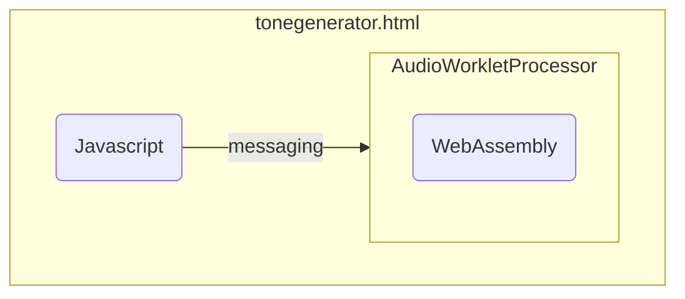

Fast WebAssembly and In-Browser Compilation with AssemblyScript
===============================================================

# Introduction

Description: AssemblyScript is a language that resembles TypeScript, but produce very fast and compact WebAssembly binaries. We’ll discuss why this language is probably the most efficient to work with if only targeting WebAssembly. We will also look into the limitations compared to TypeScript, how we can optimize it. 
 
# Structure

- High level feeling, low level control
- Limitations and the difference from regular TypeScript
- Writing performant worklets ( AudioWorklet ) for a realtime capable audio synthesizer
- Compiling AssemblyScript on the fly in the web browser

# Objectives

In this chapter you'll learn about how close you get to control low level machine code from the TypeScript-like language AssemblyScript. We'll compare it briefly to compiling C to WebAssembly. You will also learn about the limitations compared to working with TypeScript for nodejs or Web, and how you have to deal with memory management. Finally you'll learn how to use AssemblyScript for generating real time audio in the Web Browser.

# High level feeling, low level control

When working with code that executes directly on the CPU level, it's crucial to be explicit on the types for variables, and managing memory. In high level dynamically typed languages you can assign any type to a variable and when it comes to memory management, garbage collection will clean up for you. For low level programming you need to pay attention to this. By being clear on types, TypeScript improves the structure and performance of Javascript. AssemblyScript brings the code even closer to the machine level, by offering memory control like in C, and being able to opt out from or even not supporting many of the convenient high level features of TypeScript and Javascript. Still, this capability is essential when providing a high-level interface to low-level machine code. AssemblyScript makes you as efficient as in TypeScript, but let you write code performing like C.


Let's write a minimal AssemblyScript program that exports a function to add two numbers

```typescript
export function add(a: i32,b: i32): i32 {
    return a+b;
}
```

And compile it to Wasm:

`asc --noExportMemory -Oz --runtime=stub -o add.wasm add.ts`

After this we have a 41 byte wasm file that translates the following WAT:

```
(module
  (type (;0;) (func (param i32 i32) (result i32)))
  (func (;0;) (type 0) (param i32 i32) (result i32)
    local.get 0
    local.get 1
    i32.add)
  (export "add" (func 0)))
```


Let's compare this to C:

```c
int add(int a, int b) {
    return a+b;
}
```

`clang --target=wasm32 -Wl,--no-entry -nostdlib -Oz -o add.wasm add.c`

Now we get a 136 byte wasm file that translates to the following WAT:

```
(module
  (type (;0;) (func (param i32 i32) (result i32)))
  (func $add (type 0) (param i32 i32) (result i32)
    local.get 1
    local.get 0
    i32.add)
  (table (;0;) 1 1 funcref)
  (memory (;0;) 2)
  (global (;0;) (mut i32) (i32.const 66560))
  (export "memory" (memory 0))
  (export "add" (func $add)))
```

Immediately we see that AssemblyScript produce just as optimized code as C, and the resulting binary is even smaller since it doesn't export memory. Also we se that the C compiler emitted a function table and a global, even though none of these are being used by the add function either. The function table is normally used for indirect function calls, and the global i32 is normally used for the stack pointer to use by a memory allocator, but for this simple add function this is not in use and is just redundant boilerplate code. The version from AssemblyScript is equal to the hand-written 41 bytes that we saw in chapter 1, without any redundant exports or boilerplate code.

Let's try another example, counting to 100. First in C:

```c
__attribute__((export_name("countto100"))) int countTo100() {
    int n = 0;
    for (; n < 100; n++) {
    }
    return n;
}
```

We get the following WAT:

```
(module
  (type (;0;) (func (result i32)))
  (func $countTo100 (type 0) (result i32)
    i32.const 100)
  (table (;0;) 1 1 funcref)
  (memory (;0;) 2)
  (global (;0;) (mut i32) (i32.const 66560))
  (export "memory" (memory 0))
  (export "countto100" (func $countTo100)))
```

Again with the redundant table, memory and global, but notice the optimization here. Modern C/C++ compilers have decades of optimization research behind them, and they are able to recognize during the optimization passes that the code here will return 100. AssemblyScript is still a very young compiler and will not try to rewrite your code that same way.

Let's look at the AssemblyScript version:

```typescript
export function countTo100(): i32 {
    let n: i32 = 0;
    for (; n < 100; n++) {
    }
    return n;
}
```

And the resulting WAT:

```
(module
  (type (;0;) (func (result i32)))
  (func (;0;) (type 0) (result i32)
    (local i32)
    loop  ;; label = @1
      local.get 0
      i32.const 100
      i32.lt_s
      if  ;; label = @2
        local.get 0
        i32.const 1
        i32.add
        local.set 0
        br 1 (;@1;)
      end
    end
    local.get 0)
  (export "countTo100" (func 0)))
  ```

Again, no redundant parts like in C, but you see that it has implemented the loop, and did not try to calculate the result of that loop. Still you see that what you provided in the AssemblyScript source is what you get in the output binary. The compiler will not try to write better code than you, but it will give you the optimal representation in Wasm of the AssemblyScript source code you provided. So you have very good control of the code output from AssemblyScript, which is readable and easy to navigate like TypeScript. And that's what I mean when saying that AssemblyScript gives you a "High level feeling, low level control".

# "Limitations" and the difference from regular TypeScript

As you may already have noticed, in AssemblyScript we are refering to what type of number it is: `i32`, `i64`, `f32`, `f64` etc, and not just `number` as in TypeScript. The types are the same as in raw WebAssembly, and then the language is also much closer to the compilation target. Just like C and Rust. The purpose of TypeScript is first of all to give structure to JavaScript. Strong typing gives more structured code, and also better IDE support when it comes to looking up references and providing auto-completion. The purpose of AssemblyScript is to provide a familar programming language for JS/TS developers that compiles to WebAssembly. Still it is not Javascript or TypeScript and you should not expect to be able to use the same language features or libraries.

There is a lot of "unfair" criticism of AssemblyScript that it is missing a lot compared to JS/TS, that you can't use NPM libraries, lack of memory management features, closures and more. If you look at it from the perspective on how close it is to WebAssembly, these "limitations" make a lot more sense. If it had all the features of JS and TS, it would not be compatible with WebAssembly.

So as a TypeScript developer, introduced to AssemblyScript, you should not expect more similarities than having a familiar syntax. Besides that you're back to square one. To master AssemblyScript you need to master WebAssembly, but it's a lot more convenient and efficient compared to working with raw WebAssembly or WAT.

# Memory management

If you look at it from the perspective of being in control, creating small binaries and overall optimization, a key feature of AssemblyScript is that you have the possiblitiy to not have any memory management at all. Just like you saw from the first example with the parameters `--runtime=stub` and `--noExportMemory`. The resulting binary did not contain memory, or code for memory management. You can also have memory in your Wasm module, but still have no memory management code. The `--runtime` parameter controls what kind of memory management the compiled Wasm module should include, with simple allocation or even with garbage collection features. Many computationally intensive tasks, which is a typical use case for WebAssembly, are likely designed to operate on a finite memory space. For these, if any memory management is needed, it's mostly the allocation feature just for the convenience of not having to implement this ourselves. The memory used by the Wasm module will be freed as a whole when it is finished.

## Garbage collection and different runtimes

In cases where a WebAssembly instance is alive for a longer duration, and it is repeatedly allocating memory for temporary use, it might be beneficial to use the garbage collector. If we omit the `--runtime=stub` parameter, then the garbage collector of AssemblyScript is activated by default. We can easily test this by creating a small program that creates and forgets arrays in a loop.

Consider the following program:

```ts
let arr: (Array<i8> | null) = null;

for (let n = 0; n < 41; n++) {
    arr = new Array<i8>(100 * 1024 * 1024);
}
```

Here we are declaring a global variable named `arr`, and in the loop, we assign an `Array` object of 100 megabytes in size. If there is no garbage collection we should expect this program to try accessing memory out of its boundaries of 4 gigabytes when it tries to allocate the 41th array. 4 gigabytes is the memory limit of a 32 bit WebAssembly program.

We can verify this by creating a small Javascript program for nodejs that runs the `garbage.wasm` WebAssembly file:

```javascript
import { readFile } from 'fs/promises';
const wasm = await WebAssembly.instantiate(await readFile('garbage.wasm'), {
    env: {
        abort: () => {
            console.log('abort');
        }
    }
});
console.log(wasm.instance.exports.memory.buffer.byteLength / (1024 * 1024));
```

Let us first compile the AssemblyScript program, from the source file named `garbage.ts`, without garbage collection enabled.

```bash
asc garbage.ts --runtime=stub -Oz -o garbage.wasm
```

Then let us run the Javascript program that we call `garbage.js`:

`node garbage.js`

We can see that the memory access is out of bounds, because of the following error that will show in the terminal:

```bash
RuntimeError: memory access out of bounds
```

If we adjust the max number in the for-loop of the AssemblyScript program to `40`, and recompile and run the Javascript program, we can see that we don't get the `memory access out of bound` error, and that it reports a memory usage of `4000.0625`. In the last line of the Javascript program the `console.log` statement will output the size of the WebAssembly memory buffer, which at this point has grown almost to the limit of 4 gigabytes.

Let us change the max number in the for-loop to `80`, and turn on garbage collection by removing `--runtime=stub` from the compiler command arguments.

```bash
asc garbage.ts -Oz -o garbage.wasm
```

When running this we can see that the memory usage is below the limit with good margin, and even if we increase to `800`, the final memory usage stays at the same level.

In the AssemblyScript documentation about runtimes, which you can find at https://www.assemblyscript.org/runtime.html, there are alternative configurations. In addition to the `stub` and `incremental` default runtime variant, there is also the option for invoking garbage collection externally, and even implement your own custom memory allocator and garbage collector. A real time audio rendering application, as we will se below and in later chapters, benefits from reserving the memory from the beginning, and not changing memory allocations later while the application is running. An application working with memory or files, that is itensive on the Input/Output interfaces (IO), will benefit from being able to allocate and free memory often. AssemblyScript offers the possibility to customize the memory handling according to the requirements of the application you are building.

## A tone generator with a fixed memory buffer

Let us look at a use case where we don't want any dynamic memory management functionality: a real-time tone generator. We will use AudioWorklet technology to play back the sound in the browser, but instead of calculating the sine wave of the tone in JavaScript, we will call a WebAssembly module from the AudioWorklet.

Let us create the tone generator WebAssembly module in AssemblyScript:

```typescript
const SAMPLE_BUFFER_START = 1024;
const SAMPLE_BUFFER_END = 1024 + 128 * 4;

const SAMPLERATE: f32 = 44100;
let _step: f32;
let _val: f32 = 0;

export function setFrequency(frequency: f32): void {
    _step = frequency / SAMPLERATE;
}

export function fillSampleBuffer(): void {
    for (let n=SAMPLE_BUFFER_START;n<SAMPLE_BUFFER_END;n+=4) {
        _val += _step;
        _val %= 1.0;
        store<f32>(n, _val - 0.5);
    }
}
```

The `fillSampleBuffer` function will fill up a buffer of 128 samples of 32-bit floating point numbers. 128 is the number of "frames" in each render callback for an AudioWorklet. With a samplerate of 44100 samples per second, this is a buffer lasting for 2.9 milliseconds. The reason for these short buffers is to be able to provide instant response to controller events, such as changing the frequency which we provide a function for in this example. The `setFrequency` function makes it possible for the user to play the tone at another frequency, and the user has the possibility to change it every 128th frame, or every 2.9 millisecond. Such short intervals will ensure that the transitions sounds seamless and instant to the user.

For the memory management, you can see here that we have set an absolute location for the sample buffer. This is for avoiding that the compiler inserts code for memory allocation. We are also using the `store<f32>` function for writing directly to memory. This way we can be sure that the compiler does not insert additional safekeeping code for boundaries as would be the case if we provided an Array. Even though it's possible in AssemblyScript, and much more readable code, we rather write directly to memory in this case to avoid the redundant code that Array functionality would involve.

When compiling to WebAssembly the resulting WAT looks like this:

```
(module
 (type $f32_=>_none (func (param f32)))
 (type $none_=>_none (func))
 (global $tonegenerator/_step (mut f32) (f32.const 0))
 (global $tonegenerator/_val (mut f32) (f32.const 0))
 (memory $0 1)
 (export "setFrequency" (func $tonegenerator/setFrequency))
 (export "fillSampleBuffer" (func $tonegenerator/fillSampleBuffer))
 (export "memory" (memory $0))
 (func $tonegenerator/setFrequency (param $0 f32)
  local.get $0
  f32.const 44100
  f32.div
  global.set $tonegenerator/_step
 )
 (func $tonegenerator/fillSampleBuffer
  (local $0 i32)
  (local $1 f32)
  i32.const 1024
  local.set $0
  loop $for-loop|0
   local.get $0
   i32.const 1536
   i32.lt_s
   if
    global.get $tonegenerator/_val
    global.get $tonegenerator/_step
    f32.add
    global.set $tonegenerator/_val
    global.get $tonegenerator/_val
    local.tee $1
    local.get $1
    f32.trunc
    f32.sub
    local.get $1
    f32.copysign
    global.set $tonegenerator/_val
    local.get $0
    global.get $tonegenerator/_val
    f32.const -0.5
    f32.add
    f32.store $0
    local.get $0
    i32.const 4
    i32.add
    local.set $0
    br $for-loop|0
   end
  end
 )
)
```

As you can see there is not much redundant code here, it's also quite close to the hand-written WAT we saw with Sointu in the previous chapter.

To make this WebAssembly module produce sound we have to include it in a web page that set up a Web Audio context. In the audio context we set up an AudioWorklet which will host and call the WebAssembly module.

Below is a simple illustration to show this. The HTML file contains a Javascript module that sends messages to the AudioWorkletProcessor. The first message is the Wasm binary, and then a message with the frequency value every time the slider value changes.



Here is the code for the `tonegenerator.html` file:

```html
<!DOCTYPE html>
<html>
<head>
    <meta charset="UTF-8">
    <meta name="viewport" content="width=device-width, initial-scale=1.0">
</head>
<body>
    <input id="frequencyinput" type="range" min="0" max="1000" value="50" style="width: 100%" />
</body>
<script type="module">
    let ctx;
    let audioWorkletNode;
    document.getElementById('frequencyinput').addEventListener('input', async (evt) => {
        const frequency = parseFloat(evt.target.value);
        if (!ctx) {
            ctx = new AudioContext();
            await ctx.resume();
            await ctx.audioWorklet.addModule(new URL('tonegenerator.processor.js', import.meta.url));
            audioWorkletNode = new AudioWorkletNode(ctx, 'tone-generator-processor');
            audioWorkletNode.connect(ctx.destination);
            const wasmbinary = await fetch(new URL('tonegenerator.wasm', import.meta.url)).then(r => r.arrayBuffer());
            audioWorkletNode.port.postMessage({ wasmbinary, frequency }, [wasmbinary]);
        }
        if (audioWorkletNode) {
            audioWorkletNode.port.postMessage({ frequency });
        }
    });
</script>
</html>
```

and `tonegenerator.processor.js`:

```javascript
class ToneGeneratorProcessor extends AudioWorkletProcessor {
  constructor() {
    super();

    this.port.onmessage = async (message) => {
      if (message.data.wasmbinary) {
        this.wasmmodule = await WebAssembly.instantiate(message.data.wasmbinary, {});
      }
      if (this.wasmmodule && message.data.frequency) {
        this.wasmmodule.instance.exports.setFrequency(message.data.frequency);
      }
    }
  }

  process(inputs, outputs, parameters) {
    if (this.wasmmodule) {
      this.wasmmodule.instance.exports.fillSampleBuffer();
      const output = outputs[0];

      output[0].set(new Float32Array(this.wasmmodule.instance.exports.memory.buffer, 1024, 128));
    }
    return true;
  }
}

registerProcessor("tone-generator-processor", ToneGeneratorProcessor);
```

The constructor in `ToneGeneratorProcessor` contains handling of messages from the main javascript module, and the `process` method calls into the WebAssembly module for calculating audio data. The `process` method is called by Web Audio every 2.9th second given a sample rate of 44100Hz. Note that we are creating a Float32Array at memory position `1024` with length of `128`, which is the same location as we used for `store<f32>` in the AssemblyScript above.

The result is an HTML page with a slider that controls the frequency of a sawtooth wave. If you run it in a browser it will sound like an idle engine when the slider is on the left side, and a whining tone when dragged to the right.

## Using Arrays

While the WebAssembly output of our tone generator AssemblyScript was quite optimal, the AssemblyScript source code was not so readable and familiar when it comes to the use of `store<f32>` to write to memory. It would be more familiar if we could write `buffer[ndx] = value;`. We can do that, even without introducing memory allocation functionality, as long as we don't use `new` for instantiating the array. Also, in AssemblyScript we have to use a `StaticArray` which does not have a separate backing buffer, and it has a fixed length. And because it has a fixed length, that means it will add some code for checking that we don't write outside the boundaries. We really don't need that in this case, but that's some of the added overhead when we create code that should be better to maintain.

Here is the modified AssemblyScript:

```typescript
const SAMPLE_BUFFER_START = 1024;

const samplebuffer = changetype<StaticArray<f32>>(SAMPLE_BUFFER_START);
// store the byte length of the array
store<i32>(SAMPLE_BUFFER_START - sizeof<i32>(), 128 * 4);

const SAMPLERATE: f32 = 44100;
let _step: f32;
let _val: f32 = 0;

export function setFrequency(frequency: f32): void {
    _step = frequency / SAMPLERATE;
}

export function fillSampleBuffer(): void {
    for (let n = 0; n < samplebuffer.length; n++) {
        _val += _step;
        _val %= 1.0;
        samplebuffer[n] = _val - 0.5;
    }
}
```

As you can see the `fillSampleBuffer` function now looks more familiar to regular TypeScript/Javascript since we are now inserting sample values into an array instead of using the `store` function to store directly to memory. Still we are avoiding memory allocation by simply casting a pointer to a `StaticArray` using the `changetype` function. Another thing to observe is that in order to use `samplebuffer.length` we have to store this length of the array just before the array content. An i32 to define the content length before the data itself is standard memory layout for data structures in AssemblyScript. If we don't store this, the compiled Wasm code will fail, since it checks that the values we store are inside the array boundaries. Since the resulting functionality is just the same as the previous version, the extra added code for checking array boundaries are redundant, but we do obtain a source code that is more familiar to work with.

If we inspect the generated WAT from the AssemblyScript code that use StaticArray, we see now that it contains calls to getting the static array length, and also checks for the boundaries. Here's an extract of the generated WAT:

```
    call $~lib/staticarray/StaticArray<f32>#get:length
    local.get $0
    i32.le_u
    if
     unreachable
    end
    local.get $0
    i32.const 2
```

Also we see that a new `$~start` function is added:

```
 (func $~start
  i32.const 1020
  i32.const 512
  i32.store $0
 )
```

This is the code that sets the length of the StaticArray, which runs immediately when the WebAssembly module is instantiated.

For the best developer experience, to obtain a more familiar and maintainable sourcecode, we would like to just initialize the sample buffer using `new`. Instead of using `changetype` to cast the static pointer, and storing the length in the array header location, we would rather simply write `export const samplebuffer = new StaticArray<f32>(128)`.

The complete AssemblyScript source code is then much more like we would write it in regular TypeScript:

```typescript
export const samplebuffer = new StaticArray<f32>(128);

const SAMPLERATE: f32 = 44100;
let _step: f32;
let _val: f32 = 0;

export function setFrequency(frequency: f32): void {
    _step = frequency / SAMPLERATE;
}

export function fillSampleBuffer(): void {
    for (let n = 0; n < samplebuffer.length; n++) {
        _val += _step;
        _val %= 1.0;
        samplebuffer[n] = _val - 0.5;
    }
}
```

When looking at the WAT after compiling this, it comes with a slight cost increase of added memory allocation code. If we inspect it, we see that in the `$~start` function there are WebAssembly `memory` instructions to look up the size, and grow the memory if needed. With a larger codebase this added code is not so significant for the binary size. The checks for boundaries in `fillSampleBuffer` adds a little extra performance penalty compared to when we stored directly to memory. Still if we add more calculations and logic to it, there's also performance gain in an easily readable and structured source code.

The options to the `runtime` parameter of the AssemblyScript compiler does even come with a runtime that provides garbage collection. This can give a developer experience that is even closer to regular TypeScript. Still it is worth considering if this is needed in your application. If you have an application running for a long time span, where you depend on unused memory to be freed during the application life span, this might be a useful feature. On the other hand, if the application does not depend on objects and arrays to be garbage collected, you will benefit from not including garbage collection. Both in performance and binary size. When the Wasm instance is finished, the whole instance and memory resourced used will be collected by the Javascript runtime. In the use cases we are showing in this chapter, this is good enough, and we would not benefit from enabling garbage collection.

# In browser compilation

The AssemblyScript compiler can run in nodejs or in the browser. It does not depend on any native libraries, which means we can compile AssemblyScript entirely in the browser, without involving a server. This opens up for generating WebAssembly on the fly, for example based on user input.

In the following example we extend the tonegenerator above with the capability for the user to provide the function that generates the waveform. We add an input text field, where the user can enter a custom function, that will be inserted into the AssemblyScript tonegenerator sourcecode which we have now embedded into the page source.

When the user clicks the "Compile and run" button, the function from the text field is included in the source code that is passed to the AssemblyScript compiler. The resulting Wasm binary is sent to the AudioWorkletProcessor, and we hear a new sound playing based on the function code provided in the user interface.

If the user types something that does not compile, we have also added an error output where we show the error messages from the compiler.

Study the modified tonegenerator.html below, and notice that we are not loading the wasm binary file anymore, but receiving it from the AssemblyScript compiler.

```html
<!DOCTYPE html>
<html>
<head>
    <meta charset="UTF-8">
    <meta name="viewport" content="width=device-width, initial-scale=1.0">
</head>
<body>
    <h3>Frequency</h3>
    <input id="frequencyinput" type="range" min="0" max="1000" value="50" style="width: 100%" />
    <h3>Function for calculating sample value</h3>
    <input id="samplefunction" value="(angle % 1.0) - 0.5" style="width: 100%">
    <button id="compileandrunbutton">Compile and run</button>
    <p>
        <pre><code id="erroroutput"></code></pre>
    </p>
</body>
<script src="https://cdn.jsdelivr.net/npm/assemblyscript@0.27.14/dist/web.js"></script>
<script type="module">
    import asc from "assemblyscript/asc";
    let ctx;
    let audioWorkletNode;

    const frequency = () => parseFloat(document.getElementById('frequencyinput').value);

    const compileWasm = async () => {
        const erroroutput = document.getElementById('erroroutput');
        const output = {};
        const sources = {
            "tonegenerator.ts": `
const SAMPLE_BUFFER_START = 1024;
const SAMPLE_BUFFER_END = 1024 + 128 * 4;

const SAMPLERATE: f32 = 44100;
let step: f32;
let angle: f32 = 0;

export function setFrequency(frequency: f32): void {
    step = frequency / SAMPLERATE;
}

export function fillSampleBuffer(): void {
    for (let n=SAMPLE_BUFFER_START;n<SAMPLE_BUFFER_END;n+=4) {
        angle += step;
        const samplevalue = ${document.getElementById('samplefunction').value};
        store<f32>(n, samplevalue);
    }
}
`
        }
        erroroutput.innerHTML = '';
        const { error, stdout, stderr, stats } = await asc.main([
            "--runtime", "stub",
            "--use", "abort=",
            "--initialMemory", "1",
            "tonegenerator.ts",

            "--outFile", "tonegenerator.wasm",
        ], {
            readFile: name => sources.hasOwnProperty(name) ? sources[name] : null,
            writeFile: (name, contents) => output[name] = contents,
            listFiles: () => []
        });
        if (error) {
            erroroutput.innerText = stderr.toString();
        }
        const wasmbinary = output['tonegenerator.wasm'].buffer;
        audioWorkletNode.port.postMessage({ wasmbinary, frequency: frequency() }, [wasmbinary]);
    };
    document.getElementById('frequencyinput').addEventListener('input', async () => {
        if (audioWorkletNode) {
            audioWorkletNode.port.postMessage({ frequency: frequency() });
        }
    });
    document.getElementById('compileandrunbutton').addEventListener('click', async () => {
        if (!ctx) {
            ctx = new AudioContext();
            await ctx.resume();
            await ctx.audioWorklet.addModule(new URL('tonegenerator.processor.js', import.meta.url));
            audioWorkletNode = new AudioWorkletNode(ctx, 'tone-generator-processor');
            audioWorkletNode.connect(ctx.destination);
        }
        await compileWasm();
    });
</script>
</html>
```

Below are some screenshots from this HTML file.

In the first screenshot we'll see the default function: `(angle % 1.0) - 0.5`. This sounds like a sawtooth wave. The user can drag the frequency slider, and the frequency of the tone that is playing is changed immediately.


In the next screenshot, the original sound is still playing, while we are trying to compile a sine waveform function: `Mathf.sin(2 * Math.PI * angle)`. Now we see the compiler errors display. The problem with the function we provided is that for 32 bit floats we have to use the `Mathf` library in AssemblyScript. It's our `Math.PI` that is wrong, so we must change it to `Mathf.PI` so that the whole function expression becomes: `Mathf.sin(2 * Math.PI * angle)`.


Finally, we will make a more complex function. The sound from the previous screenshots are still playing, but when we click the compile button, the sound changes immediately. 


The compiler takes just a fraction of a second to complete, and is sending the resulting Wasm binary to the AudioWorkletProcessor. If you look at the AudioWorkletProcessor code above ( the file `tonegenerator.processor.js` we created above ), you can see that there is a message handler:

```javascript
if (message.data.wasmbinary) {
    this.wasmmodule = await WebAssembly.instantiate(message.data.wasmbinary, {});
}
```

This part will instantiate the new binary that we received from the compiler via the messageport, and then the `process` function will use that new binary instead for producing audio data.

# Conclusion

We have seen how AssemblyScript provides a high level representation and interaction with low-level WebAssembly code. It is also important to understand that AssemblyScript is not TypeScript, and it would never serve its purpose if it evolved in that direction. The showcases in this chapter demonstrated how AssemblyScript can be efficient in writing a fast performing AudioWorklet that produce live audio. In these showcases we also demonstrated different ways of interacting with memory. Finally we explored live compilation of AssemblyScript to Wasm in the browser, without involving a server.

Note that in this chapter we have only looked into a few of the capabilities of AssemblyScript. To get the full understanding you should consult the AssemblyScript website https://assemblyscript.org, where you find links to the documentation and github project, as well as links to many example projects.

In the next chapter we will look at tools and methods for optimizing WebAssembly for performance and size.
