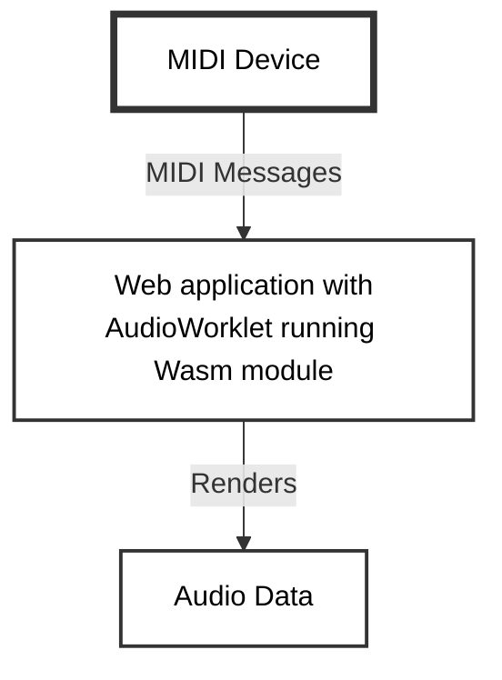

# Chapter 9: Compiling WebAssembly to C

# Introduction

In the previous chapters we have been compiling C to WebAssembly for many different purposes. Now we will look at converting WebAssembly to C source code. One use case for this is when we have code written in languages that only compile to WebAssembly, and we would like to use it for another platform target. AssemblyScript is such a language that only compiles to WebAssembly, but by converting the WebAssembly binary to C, we can recompile it as platform native code. The examples in this chapter are based on the WebAssembly Music project which can be found at https://github.com/petersalomonsen/javascriptmusic, and the method of creating an executable music player which was described in the article "Using WebAssembly modules from C" written in 2020 by the author of this book.

# Structure

- wasm2c - a WebAssembly to C converter
- Interacting with memory in the wasm2c generated code
- Creating an Audio/Midi plugin from AssemblyScript

# Objectives

In this chapter you should get more familiar with the `wasm2c` tool from the WebAssembly binary toolkit. You will learn how to use it to convert a WebAssembly binary to C source code, and how to use that in a C/C++ application. The interfaces for interacting with the converted Wasm file, are not very different from when using the Wasm binary from Javascript. From the examples in this chapter you should get the understanding of this similarity, and how to use it from C. You will also get a basic introduction to writing Synthesizer plugins in AssemblyScript, that can be used in a Digital Audio Workstation ( DAW ). You will see how the audio rendering logic comes from the converted WebAssembly binary, and is used in the context of the JUCE plugin framework.

# wasm2c - a WebAssembly to C converter

In the WebAssembly Binary Toolkit ( WABT ), which you can find at https://github.com/WebAssembly/wabt, there's a tool called `wasm2c`. This tool is simply converting a WebAssembly binary file to C source code. If we have WebAssembly code written from scratch, or written in a language that only compiles to Wasm, we can use `wasm2c` to create C source code from it. With the C source code we can reuse that WebAssembly code on many platforms.

Let us start with a simple example, that we've already used several times, which is adding two numbers:

```
(module
  (func $add (param $a i32) (param $b i32) (result i32)
    local.get $a
    local.get $b
    i32.add)
  (export "add" (func $add))
)
```

We can convert this to WebAssembly using `wat2wasm`:

```bash
wat2wasm add.wat
```

And then convert it to C source code:

```bash
wasm2c add.wasm -o add.c
```

From this we get two files: `add.c` and `add.h`. They contain a lot more than just the function for adding numbers. The Wasm binary is converted to C code that can be compiled on many platforms, and have all the needed C code to support WebAssembly instructions and memory features.

If we study `add.c` closer, we are able to find our `add` function translated to C:

```c
u32 w2c_add_add_0(w2c_add* instance, u32 var_p0, u32 var_p1) {
  FUNC_PROLOGUE;
  u32 var_i0, var_i1;
  var_i0 = var_p0;
  var_i1 = var_p1;
  var_i0 += var_i1;
  FUNC_EPILOGUE;
  return var_i0;
}
```

We can create a simple executable in C that use this function:

```c
#include "./add.h"
#include <stdio.h>

int main() {
    int sum = w2c_add_add(NULL, 5, 8);
    printf("sum: %d\n", sum);
    return 0;
}
```

And to compile it we need to have `wasm2c` in our include path. We can export it to a variable that we call `WASM2C` like this:

```bash
export WASM2C=/path/to/wabt/1.0.34/share/wabt/wasm2c
```

Then we are able to run the compiler:

```bash
clang -O3 -I$WASM2C -I/opt/homebrew/include main.c $WASM2C/wasm-rt-impl.c add.c -o add
```

The result is an executable called `add`. If we run this we see the output:

```
sum: 13
```

which is the result of invoking our WebAssembly translated to C with the numbers 5 and 8.

When we look at the invocation `w2c_add_add(NULL, 5, 8)`, we see that the first parameter is `NULL`. Normally this parameter would have been a pointer to an instance structure which contains global variables, memory and function tables. Since our `w2c_add_add` does not use any of this, we can ignore this parameter, but in most cases our Wasm code will interact with memory or global variables. We will see this when we look into a more complex example.

# Interacting with memory in the wasm2c generated code

The code generated by `wasm2c` provides an instance struct of our WebAssembly module. We can set up multiple instances of it if we want to, but let us see how we can interact with data in a single instance.

Let us translate the `tonegenerator.wasm` from chapter 3 to C. We had multiple versions, demonstrating different ways of storing the sample data to memory. Let us take the version that used a `StaticArray` in AssemblyScript:

```typescript
export const samplebuffer = new StaticArray<f32>(128);

const SAMPLERATE: f32 = 44100;
let _step: f32;
let _val: f32 = 0;

export function setFrequency(frequency: f32): void {
    _step = frequency / SAMPLERATE;
}

export function fillSampleBuffer(): void {
    for (let n = 0; n < samplebuffer.length; n++) {
        _val += _step;
        _val %= 1.0;
        samplebuffer[n] = _val - 0.5;
    }
}
```

We compile this to wasm with the AssemblyScript compiler:

```bash
asc -Oz --runtime=stub --use=abort= -o tonegenerator.wasm tonegenerator.ts
```

And then we can translate it to C:

```bash
wasm2c tonegenerator.wasm -o tonegenerator.c
```

When interacting with this from Javascript, we remember that we had to set the frequency of the tone by calling the `setFrequency` function. We called the `fillSampleBuffer` to generate the audio data, and then we copied the contents from WebAssembly `memory` into the `AudioBuffer` of the `AudioWorkletProcessor`.

In our C code, we are now going to do almost the same, but rather than connecting to audio output, we are going to write to a `WAV` file. 

Here is the complete C code for an executable that will use our WebAssembly binary translated to C, to generate a sound and write it to a Wav file:

```c
#include "./tonegenerator.h"
#include "./wavheader.h"
#include <stdio.h>

w2c_tonegenerator tonegenerator;

int main()
{
    wasm_rt_init();
    wasm2c_tonegenerator_instantiate(&tonegenerator);

    int CHUNK_FRAMES = 128;
    int SAMPLERATE = 44100;
    int DURATION_SECONDS = 10;

    FILE *fptr;
    fptr = fopen("test.wav", "w");

    writeWavHeader(fptr, SAMPLERATE, 2, 32, DURATION_SECONDS * SAMPLERATE * 2);

    wasm_rt_memory_t *memory = w2c_tonegenerator_memory(&tonegenerator);
    u32 *samplebufferaddr = w2c_tonegenerator_samplebuffer(&tonegenerator);
    f32 *samplebuffer = (f32*)(memory->data + *samplebufferaddr);

    f32 frequency = 30.0;

    for (int chunkNo = 0; chunkNo < (DURATION_SECONDS * SAMPLERATE / CHUNK_FRAMES); chunkNo++)
    {
        w2c_tonegenerator_fillSampleBuffer(&tonegenerator);

        w2c_tonegenerator_setFrequency(&tonegenerator, frequency);
        for (int ndx = 0; ndx < CHUNK_FRAMES; ndx++)
        {
            float left = samplebuffer[ndx];
            float right = samplebuffer[ndx + 128];
            fwrite(&left, 1, sizeof(left), fptr);
            fwrite(&right, 1, sizeof(right), fptr);
        }

        frequency+=0.02;
    }

    fclose(fptr);
}
```

In this source code, we first see the instance struct declaration of our translated Wasm module: `w2c_tonegenerator tonegenerator`. Further down in the code we refer to this instance struct when calling the Wasm module functions. Before we can call any of it we need to call `wasm_rt_init`, which will set up the runtime environment for our Wasm binary converted to C. Then we call `wasm2c_tonegenerator_instantiate` which will set up the memory and the global variables for the instance struct.

After setting up, we call `w2c_tonegenerator_memory` to get a pointer to what represents the WebAssembly module's memory. The `w2c_tonegenerator_samplebuffer` gives us the offset into this memory buffer for where we will find the sample data generated by `w2c_tonegenerator_fillSampleBuffer`, which we call in the loop that produce 128 samples each iteration. We call `w2c_tonegenerator_setFrequency` to change the frequency of the tone.

We are writing to the file `test.wav` and the first part of this file is a header which we have a function for writing in the file `wavheader.h` with the following source code:

```c
#include <stdio.h>

#ifndef WAVHEADER_H_
#define WAVHEADER_H_

void writeWavHeader(FILE *fp, int sampleRate, int numChannels, int bitsPerSample, int numSamples) {
    int byteRate = sampleRate * numChannels * bitsPerSample / 8;
    int blockAlign = numChannels * bitsPerSample / 8;

    fwrite("RIFF", sizeof(char), 4, fp);
    int chunkSize = 36 + numSamples * numChannels * bitsPerSample / 8;
    fwrite(&chunkSize, sizeof(int), 1, fp);
    fwrite("WAVE", sizeof(char), 4, fp);

    fwrite("fmt ", sizeof(char), 4, fp);
    int subChunk1Size = 16;
    fwrite(&subChunk1Size, sizeof(int), 1, fp);
    short audioFormat = 3;
    fwrite(&audioFormat, sizeof(short), 1, fp);
    fwrite(&numChannels, sizeof(short), 1, fp);
    fwrite(&sampleRate, sizeof(int), 1, fp);
    fwrite(&byteRate, sizeof(int), 1, fp);
    fwrite(&blockAlign, sizeof(short), 1, fp);
    fwrite(&bitsPerSample, sizeof(short), 1, fp);

    fwrite("data", sizeof(char), 4, fp);
    int subChunk2Size = numSamples * numChannels * bitsPerSample / 8;
    fwrite(&subChunk2Size, sizeof(int), 1, fp);
}

#endif  /* WAVHEADER_H_ */
```

We are now ready to compile this into an executable file that we name `tonegenerator`. We need to point the compiler to `wasm2c` and system include files when running the compiler with the following commands:

```bash
export WASM2C=/path/to/wabt/1.0.34/share/wabt/wasm2c   
clang -O3 -I$WASM2C -I/path/to/include main.c $WASM2C/wasm-rt-impl.c tonegenerator.c -o tonegenerator
```

We can then run the `tonegenerator` executable that will produce `test.wav`. When playing `test.wav` we will hear a 10 second long sawtooth sound that increase in frequency over time.

# Creating an Audio/Midi plugin from AssemblyScript

Now that we have seen how to convert WebAssembly to C, and we have created an executable that use it, let us look into a use case where this feature is essential. "WebAssembly Music" is a web-based software that you can find at https://github.com/petersalomonsen/javascriptmusic, and lets you create music and digital instruments in code. For the instruments, AssemblyScript is used. The source code editor is in the browser, and every time you click the save button, a WebAssembly module is compiled on the fly. This WebAssembly module is loaded into an `AudioWorkletProcessor` like we saw in chapter 3, and by sending note on and off messages on the message channel. Just like the WebAssembly module above has a `setFrequency` function, the WebAssembly modules created in the "WebAssembly Music" studio has a function called `shortmessage`. This function takes 3 parameters, 3 bytes with values from 0 to 255, which are according to the MIDI specification. The MIDI specification defines the format of messages to be sent to electronic musical instruments, and the short message format is the most used for many purposes like:

- Note on / off ( contains channel number 0-15, note number 0-127 and velocity 0-127 )
- Control change ( used for channel volume, sustain pedals, reverb/chorus level, panning and more )
- Pitch bend

If we want the WebAssembly module to play the note C5 ( note number `60` ) on channel `0` with velocity `100`, we can call `shortmessage(0x80, 60, 100)`. To stop the note from playing we do the same call with velocity `0`.

Here is a simplified illustration of how it is connected when running in the browser.



Plugin instruments that we can use in Digital Audio Workstation software like Logic, Ableton Live, Cubase, FL studio and many more, follows a similar pattern, but there is no web browser involved. The plugin instruments are not WebAssembly modules. The most popular plugin standards are VST3 and AudioUnits ( Mac only ), and plugins are normally written in C or C++. We can use `wasm2c` for converting instruments that we have made using "WebAssembly Music", into VST3 or AudioUnit plugin instruments.

A very popular framework for creating such plugins is JUCE ( https://juce.com/ ). We will now create a simple instrument in "WebAssembly Music", convert it to C, and integrate it with JUCE to create a VST3 plugin.

We will start by creating the instrument in AssemblyScript:

```ts
import { MidiVoice, notefreq, midichannels, MidiChannel, SawOscillator, Envelope, BandPass } from '../mixes/globalimports';

class Pad extends MidiVoice {
    osc: SawOscillator = new SawOscillator();
  	osc2: SawOscillator = new SawOscillator();
  	osc3: SawOscillator = new SawOscillator();
  	osc4: SawOscillator = new SawOscillator();
  	osc5: SawOscillator = new SawOscillator();
    env: Envelope = new Envelope(0.02, 0.4, 0.5, 1.0);
	bp2: BandPass = new BandPass(20, 5000);

    noteon(note: u8, velocity: u8): void {
        super.noteon(note, velocity);
        const adjustednote = note;
        this.osc.frequency = notefreq(adjustednote);
      	this.osc2.frequency = notefreq(adjustednote as f32 + 0.1);
      	this.osc3.frequency = notefreq(adjustednote as f32 - 0.1);
      	this.osc4.frequency = notefreq(adjustednote as f32 + 0.15);
      	this.osc5.frequency = notefreq(adjustednote as f32 - 0.15);
        this.env.attack();
    }

    noteoff(): void {
        this.env.release();
    }

    isDone(): boolean {
        return this.env.isDone();
    }

    nextframe(): void {
      	const osc1 = this.osc.next();
      	const osc2 = this.osc2.next();
      	const osc3 = this.osc3.next();
      	const osc4 = this.osc4.next();
      	const osc5 = this.osc5.next();

        const left = this.bp2.process((
          osc1 + osc2 + osc3 * 0.5 + osc4
            
        )
        			* this.env.next()
        			* this.velocity * 0.01);
      
      const right = this.bp2.process((
          osc1 + osc2 *0.5 + osc3 + osc5
        )
        			* this.env.next()
        			* this.velocity * 0.01);
      
       	
       	this.channel.signal.add(left, right);
        
    }
}

export function initializeMidiSynth(): void {
  midichannels[0] = new MidiChannel(10, (ch) => new Pad(ch));
  midichannels[0].controlchange(91,50);
}

export function postprocess(): void {
}
```

We type this sourcecode into the "synth" editor as we can see in the screenshot below.


Then we click the download button in the upper right corner and select "WASM Library module", and click "Export". A file called `song.wasm` will be downloaded, and we can use `wasm2c` to convert this to C:

```bash
wasm2c song.wasm -n instruments -o instruments.c
```

We use the `-n` parameter to name the module `instruments`, and we save it to the file `instruments.c`. JUCE plugins are written in C++, so in order to use it from C++, we will first create a static library from the C files that we will link into our C++ plugin code.

We call the static library file `instrlib.c` which is a simple C library that creates an instance of the code we've converted from Wasm.

```c
#include "./instruments.h"

typedef struct w2c_environment
{
    f32 SAMPLERATE;
} w2c_environment;

w2c_instruments instance;
w2c_environment environment;

f32 *w2c_environment_SAMPLERATE(struct w2c_environment *environment)
{
    return &environment->SAMPLERATE;
}

void instrlib_init(f32 samplerate)
{
    wasm_rt_init();
    environment.SAMPLERATE = samplerate;
    wasm2c_instruments_instantiate(&instance, &environment);
}

void instrlib_fillsamplebufferwithnumsamples(int num_samples) {
    w2c_instruments_fillSampleBufferWithNumSamples(&instance, num_samples);
}

f32 *instrlib_getSampleBuffer()
{
    wasm_rt_memory_t *memory = w2c_instruments_memory(&instance);
    u32 *samplebufferaddr = w2c_instruments_samplebuffer(&instance);
    return (f32 *)(memory->data + *samplebufferaddr);
}

void instrlib_shortMessage(u32 d0, u32 d1, u32 d2)
{
    w2c_instruments_shortmessage(&instance, d0, d1, d2);
}
```

This provides functions for initializing, filling the sample buffer with audio data, getting the sample buffer memory address, and passing a MIDI short message. It is all we need for creating an instrument that we can play through music software that can host instrument plugins.

Let us build it as a static library:

```bash
WASM2C=/path/to/wabt/1.0.34/share/wabt/wasm2c   
clang -O3 -I$WASM2C -I/path/to/include instruments.c $WASM2C/wasm-rt-impl.c instrlib.c -c
ar -rcs libinstrlib.a instruments.o instrlib.o wasm-rt-impl.o
```

The output is the static library file `libinstrlib.a`.

Now we can code our plugin, and we will switch to C++. A minimal JUCE audio synthesizer can be implemented in a single `.cpp` file. Let us call it `wasmsynth.cpp` with the following source code:

```cpp
#include <JuceHeader.h>

extern "C" void instrlib_init(float samplerate);
extern "C" void instrlib_fillsamplebufferwithnumsamples(int numsamples);
extern "C" float *instrlib_getSampleBuffer();
extern "C" void instrlib_shortMessage(uint32_t d0, uint32_t d1, uint32_t d2);

class WasmSynth final : public AudioProcessor
{
public:
    WasmSynth()
        : AudioProcessor(BusesProperties().withOutput("Output", AudioChannelSet::stereo()))
    {
    }

    static String getIdentifier()
    {
        return "Wasm Synth";
    }

    void prepareToPlay(double newSampleRate, int) override
    {
        synth.setCurrentPlaybackSampleRate(newSampleRate);
        printf("Samplerate is %f\n", newSampleRate);
        instrlib_init((float)newSampleRate);
        printf("Prepare complete");
    }

    void releaseResources() override {}

    void processBlock(AudioBuffer<float> &buffer, MidiBuffer &midiMessages) override
    {
        for (const auto metadata : midiMessages)
        {
            MidiMessage message = metadata.getMessage();
            const uint8 *rawmessage = message.getRawData();
            printf("%d, %d, %d\n", rawmessage[0], rawmessage[1], rawmessage[2]);
            instrlib_shortMessage(rawmessage[0], rawmessage[1], rawmessage[2]);
        }

        int numSamples = buffer.getNumSamples();
        auto *left = buffer.getWritePointer(0);
        auto *right = buffer.getWritePointer(1);

        for (int sampleNo = 0; sampleNo < numSamples; sampleNo += 128)
        {
            int numSamplesToRender = numSamples - sampleNo;
            if (numSamplesToRender > 128) {
                numSamplesToRender = 128;
            }
            instrlib_fillsamplebufferwithnumsamples(numSamplesToRender);
            float *renderbuf = instrlib_getSampleBuffer();
            for (int ndx = 0; ndx < numSamplesToRender; ndx++)
            {
                left[sampleNo + ndx] = renderbuf[ndx] * 0.3;
                right[sampleNo + ndx] = renderbuf[ndx + 128] * 0.3;
            }
        }
    }

    using AudioProcessor::processBlock;

    const String getName() const override { return getIdentifier(); }
    double getTailLengthSeconds() const override { return 0.0; }
    bool acceptsMidi() const override { return true; }
    bool producesMidi() const override { return true; }
    AudioProcessorEditor *createEditor() override { return nullptr; }
    bool hasEditor() const override { return false; }
    int getNumPrograms() override { return 1; }
    int getCurrentProgram() override { return 0; }
    void setCurrentProgram(int) override {}
    const String getProgramName(int) override { return {}; }
    void changeProgramName(int, const String &) override {}
    void getStateInformation(juce::MemoryBlock &) override {}
    void setStateInformation(const void *, int) override {}

private:
    Synthesiser synth;
    JUCE_DECLARE_NON_COPYABLE_WITH_LEAK_DETECTOR(WasmSynth)
};

juce::AudioProcessor *JUCE_CALLTYPE createPluginFilter()
{
    return new WasmSynth();
}
```

In the source code above we start by referencing the functions of `libinstrlib.a`. The important part goes on in the `processBlock` function, where the incoming MIDI messages are read, and audio is rendered.

To build the plugin we need to download JUCE sources:

```bash
wget https://github.com/juce-framework/JUCE/archive/refs/tags/7.0.9.tar.gz
tar -xvzf 7.0.9.tar.gz
rm 7.0.9.tar.gz
```

This will create a folder named `JUCE-7.0.9` which contains the sources for JUCE. JUCE supports `CMake` for building, which we will use for this example.

To build with `CMake` we need to create a file named `CMakeLists.txt`, that we will put in the same directory as the other sourcefiles we have created here. This file has the following content:

```
cmake_minimum_required(VERSION 3.15)

project(WasmSynth VERSION 0.0.1)

add_subdirectory(JUCE-7.0.9)

juce_add_plugin(WasmSynth
    COMPANY_NAME "WebAssemblyMusic"
    IS_SYNTH TRUE
    NEEDS_MIDI_INPUT TRUE
    NEEDS_MIDI_OUTPUT FALSE
    IS_MIDI_EFFECT FALSE
    COPY_PLUGIN_AFTER_BUILD TRUE
    PLUGIN_MANUFACTURER_CODE WaMu
    PLUGIN_CODE Wasm
    FORMATS VST3 AU Standalone)

target_sources(WasmSynth
    PRIVATE
        wasmsynth.cpp)

target_compile_definitions(WasmSynth
    PRIVATE
        JUCE_VST3_CAN_REPLACE_VST2=0)

target_link_libraries(WasmSynth
    PRIVATE
        ${CMAKE_CURRENT_SOURCE_DIR}/libinstrlib.a
        juce::juce_audio_utils
    PUBLIC
        juce::juce_audio_plugin_client
        juce::juce_dsp)

juce_generate_juce_header(WasmSynth)
```

Take note of the `just_add_plugin` statement which declares some important properties of the plugin. For example it declares that it is a synth, and that it needs MIDI input. It also tells which pluginformats we want to create, and in this case we have defined `VST3`, `AU` and `Standalone`.

`CMakeLists.txt` also points to the source file of the plugin, and the static library we created from the WebAssembly binary converted to C.

As with most `CMake` projects we need to create a directory for building. So we create this by typing `mkdir build`.

Then we should enter this directory and build from it:

```bash
cd build
cmake ..
cmake --build .
```

We do now have plugins installed on our system that we can load into a DAW software. If you don't have it, you can also use the built-in `AudioPluginHost` from JUCE.

To build the `AudioPluginHost` with JUCE-7.0.9, you can follow these steps:

```
cd JUCE-7.0.9
cmake . -B cmake-build -DJUCE_BUILD_EXAMPLES=ON -DJUCE_BUILD_EXTRAS=ON
cmake --build cmake-build --target AudioPluginHost
```

You will then find the `AudioPluginHost` executable on this path:

`./cmake-build/extras/AudioPluginHost/AudioPluginHost_artefacts/AudioPluginHost.app/Contents/MacOS/AudioPluginHost`

Below is a screenshot of our newly created plugin inside the AudioPluginHost:


# Conclusion

We have seen how we can go from a language that only supports WebAssembly, and use it from a C/C++ application, without introducing a WebAssembly runtime. From the converted C code we saw the same exported functions and globals available, as when using the Wasm binary from Javascript. We have revisited the tonegenerator example from chapter 3, to see how we can create an executable file that produce an audio file. Finally we saw we could reuse a WebAssembly binary that normally generates instrument sounds in the browser for the WebAssembly Music application. By converting it to C we could integrate it with the JUCE framework to create a synthesizer plugin for use in a Digital Audio Workstation.

In the next chapter we will go back to compiling C to WebAssembly, and focus on a scenario that is challenging when mixing C and JavaScript. In C code, you can put your thread to sleep while waiting for some event to occur. In JavaScript, which is single threaded, you cannot block the same way, and other code has to be allowed to run in the thread until the awaited event occurs. We will look into how we can "bridge" these different worlds by instrumenting our WebAssembly code to handle the asynchronous nature of JavaScript..

# Points to remember

- The WebAssembly Binary toolkit contains the application `wasm2c` which is used to convert WebAssembly binaries to C code
- The converted C code can be integrated into any C/C++ application, without involving a WebAssembly runtime
- We can convert WebAssembly binaries that originates from any language, such as AssemblyScript which is a language that only compiles to WebAssembly
- Converting WebAssembly to C is an efficient way to re-use Wasm code across platforms and in non-browser environments
