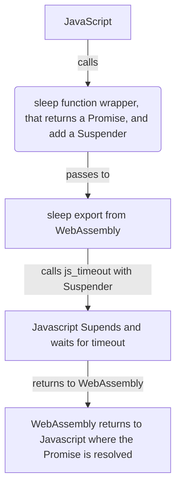

# Chapter 10: Asynchronous WebAssembly

# Introduction

Javascript code should never block. We cannot create a loop to wait for a state to be changed. In JavaScript every code block is executed as the result of an event. If we want some code to be executed after a state change, we need an event handler for that state change. In modern Javascript we have the concept of `async` / `await`, which let us write the code in a more readable way, without callback functions. It is still not the same as in for example C where you can wait in a blocking loop. In Javascript, one single thread is shared for all the events, and so each event handler must be quick. In C there can be parallell synchronuous long running code blocks, each occupying its own thread. When running WebAssembly inside Javascript, in the browser, it should not block execution, and it should return fast. C programs compiled to WebAssembly may not have been written to return immediately. They may wait for IO operations such as network or user input, using a blocking loop while waiting. In this chapter we will address different techniques to overcome this difference. We will look into ways of running synchronous code compiled to WebAssembly, in an asynchronuous Javascript runtime environment.

# Structure

- The problem with blocking WebAssembly functions
- Callbacks for promise results
- Emscripten Asyncify
- Asyncify with Binaryen
- Using shared memory, and atomics
- Enabling async / await capabilities for QuickJS
- JavaScript Promise Integration

# Objectives

In this chapter you will learn various methods for connecting asynchronous Javascript code to syncrhonous WebAssembly. First you will be introduced to why this is an issue, and then we will look at the ways of solving it. You will learn how to use the `Asyncify` feature with Emscripten and Binaryen. You will learn a technique using multiple workers with shared memory and atomics for waiting and notification. We will also revisit QuickJS, the Javascript engine that runs inside WebAssembly, and show how you can even run asynchronous Javascript code inside it. Finally you will be introduced to the brand new, and currently in an experimental state JavaScript Promise Integration API.

# The problem with blocking WebAssembly functions

In WebAssembly we can import functions from the host environment. For example we can create a small WebAssembly program that imports a function from the host to get the current time. When such an imported function returns a result, we can use it directly in the WebAssembly module, which can then process it and return the final result to the caller.

The WebAssembly module below exports a function named `tomorrow`, which will call the imported function `current_time` and add 86400 seconds, 24 hours, to get the same time tomorrow.

```WebAssembly
(module
  (import "env" "current_time" (func $current_time (result i32)))

  (func $tomorrow (result i32)
    call $current_time
    i32.const 86400
    i32.add
  )
  (export "tomorrow" (func $tomorrow))
)
```

Let us convert it into a `.wasm` file:

```bash
wat2wasm tomorrow.wat -o tomorrow.wasm
```

And then we can instantiate and call the `tomorrow` function from Javascript like we can see in the code snippet below.

```javascript
mod = await WebAssembly.instantiate(await fetch('tomorrow.wasm').then(r => r.arrayBuffer()), {
    env: {
        current_time: () => new Date().getTime()/1000 
    }
});
console.log(new Date(mod.instance.exports.tomorrow()*1000));
```

You can see that we provide the WebAssembly module with the `current_time` function. Since this immediately returns a result to the WebAssembly module, it is also possible to return the result directly to the caller of the `tomorrow` function. This function call does not block, nor does it depend on a callback.

As long as the imported functions returns a result immediately, and our code does not have to wait, this works fine. But if the imported functions are `async` functions, then WebAssembly will not be able to wait for the result.

Examples `async` operations in the browser is fetching data from the network, or just "sleeping". Before we implement an `async` sleep function that release the CPU for other tasks, let us show what a blocking sleep can look like.

Consider the snippet below, where we have repeated calls to `$current_time` and we are looping until the specified duration has passed. The problem with this is that it does not give the CPU a real pause, and we will demonstrate this below when calling it from Javascript.

```
(module
  (import "env" "current_time" (func $current_time (result i32)))
  (func $sleep (param $duration i32)
    local.get $duration
    call $current_time
    i32.add
    local.set $duration
    loop $while_sleeping
      call $current_time
      local.get $duration
      i32.lt_s
      br_if $while_sleeping
    end
  )
  (export "sleep" (func $sleep))
)
```

We translate it to wasm by typing `wat2wasm sleep.wat -o sleep.wasm`, and we can run it in the browser by typing the following into the developer tools console.

```javascript
mod = await WebAssembly.instantiate(await fetch('sleep.wasm').then(r => r.arrayBuffer()), {
    env: {
        current_time: () => new Date().getTime()/1000 
    }
});
console.log('before sleep');
mod.instance.exports.sleep(5);
console.log('after sleep');
```

You can immediately observe that the HTML page is unavailable while the `sleep` function is running. Any clicks inside the page have no effect, but suddenly when sleep is done, all the pending page events are fired.

This demonstrates the point that in WebAssembly we cannot have code that polls for a state change in a loop, since events that changes the state will fire after the WebAssembly function is done. If we trigger a network request, we cannot have a loop waiting for the result to be ready, since the polling loop would block for the result event to be fired.

When the result of a call arrives as an event, our WebAssembly module must provide a callback function to process the result.

# Callbacks for promise results

If our WebAssembly module is not going to block execution while waiting for sleep to finish, a network request to complete, or any other async operation, we have to exit from the WebAssembly module while waiting. This means that our WebAssembly module must have a callback function that can be called when sleep is finished.

The Wasm module below has the `sleep` function that stores the start time of when it was invoked. It calls the imported `timeout` function and exists. Then it has the `sleep_callback` function which will calculate the duration since `sleep` was invoked, and return that result.

```wat
(module
  (import "env" "current_time" (func $current_time (result i32)))
  (import "env" "timeout" (func $timeout (param i32)))
  (global $start_time (mut i32) (i32.const 0))
  (func $sleep (param $duration i32)
    call $current_time
    global.set $start_time
    local.get $duration
    call $timeout
  )
  (func $sleep_callback (result i32)
    call $current_time
    global.get $start_time    
    i32.sub
  )
  (export "sleep" (func $sleep))
  (export "sleep_callback" (func $sleep_callback))
)
```

Just calling `sleep` from Javascript will not block for the specified time, as the previous example did. Now the sleep method will return immediately, but it has called the imported `timeout` method, which we should set up to call `sleep_callback` after the specifed duration. 

In the Javascript code below, you can see how we call sleep inside a promise, and set the `timeout_done` implementation to resolve that promise with the result of calling `sleep_callback` on the WebAssembly module.

```javascript
mod = await WebAssembly.instantiate(await fetch('asyncsleep.wasm').then(r => r.arrayBuffer()), {
    env: {
        current_time: () => new Date().getTime()/1000,
        timeout: (duration) => setTimeout(() => timeout_done(), duration * 1000)
    }
});
console.log('before sleep');
actual_sleep_duration = await new Promise(resolve => {
    mod.instance.exports.sleep(5);
    timeout_done = () => {
        resolve(mod.instance.exports.sleep_callback());
    };
});
console.log('after sleep. actual sleep duration was',actual_sleep_duration);
```

This way we are able to provide the result of an async operation back to WebAssembly. We need to split the WebAssembly implementation into parts before and after the async operation, which also adds more complexity when it comes to reading and understanding the WebAssembly code. We would like to hide this complexity when writing higher level code for WebAssembly. If we are compiling existing C code to WebAssembly, we might not even have the possibility to split it that way. Fortunately, Emscripten has the `asyncify` feature that compiles the code so that it has callback functions for the result of async operations, without having to modify the C source code.

# Emscripten Asyncify

In chapter 6 we used the `asyncify` feature of Emscripten to support asynchronuous network calls. We will now look into how this feature works. Let us create a simple C program that calls an external async function with the name `js_timeout`.

```c
#include "emscripten.h"
#include <stdio.h>

EM_ASYNC_JS(int, timeout, (int duration), {
  return await js_timeout(duration);
});

EMSCRIPTEN_KEEPALIVE
void wasm_sleep(int duration) {
    printf("Before sleep %d\n", 12345);
    int result = timeout(duration);
    printf("After sleep %d\n", result);
}
```

This exports the `wasm_sleep` function which prints a line before and after calling the `js_timeout` function that is imported from Javascript. We compile it with the `ASYNCIFY` feature enabled:

```bash
emcc asyncify.c -O2 -sASYNCIFY -o asyncify.js
```

We should have a small HTML page to load the Emscripten module, including a script to call it.

```html
<html>
    <body>
    </body>
    <script src="asyncify.js"></script>
    <script type="module">
        Module.onRuntimeInitialized = () => {
            globalThis.js_timeout = async (duration) => await new Promise(resolve => setTimeout(() => resolve(54321), duration*1000));
            Module._wasm_sleep(5);
        };
    </script>
</html>
```

From the script you can see that we declare the global `js_timeout` function that is called from inside the C code. We are calling the `wasm_sleep` command on the module, and we can wait for it to complete.

Both the generated wasm and js are large files, so listing them here would be too much, but we can inspect the asyncify behavior closer in a debug session in the browser.

Let us open the `Sources` tab in the browser (chrome) developer tools, open the `wasm` file, and place 3 breakpoints in it.

We start by placing a breakpoint in the beginning of the `wasm_sleep` function.


Then we search for `12345`, which you can see from the C source code above was what we printed along with "before sleep". We have this in our source, just to be able to find it in the compiled Wasm.


The third breakpoint we will set when the imported function from JavaScript is called. In the html file above you can see that we have defined a function on the global scope named `js_timeout`. In the Wasm file you will find an import called `__asyncjs__timeout`, and we will search for the location where this is called, and insert a breakpoint there.


When we reload the page after placing these breakpoints, we can see that execution immediately stops at the breakpoint in the beginning of the `wasm_sleep` function. When we resume execution, we can see that it stops at the breakpoint where the constant `12345` is declared. Resuming execution again, the "before sleep 12345" message is printed on the console, and with hit the breakpoint where we have the call to the `js_timeout` function.

If we step over this function call, we can see on the stack that the resulting value from the call is `0`, and not `54321` which we can see that is the resolved value of the `js_timeout` function we have defined in the HTML/Javascript code above.


This is because we don't resolve the promise before the specified duration of the timeout has passed.

If we resume execution, it returns to Javascript, without printing the `after sleep` message to the console. This is where the asyncify "magic" comes into play. The Asyncify feature will now store the state of the execution so far, so that when `wasm_sleep` is called the next time, after the timeout promise has resolved, execution can resume from where it waited for the result of `js_timeout`.

When the timeout duration of 5 seconds has passed, the promise is resolved with the value `54321`. We can see that execution stops at the beginning of the `wasm_sleep` function. When resuming execution, we don't hit the second breakpoint with the declaration of `12345`. Execution skips everything that was before it had to pause in the first invocation of `wasm_sleep`.

Again we hit the third breakpoint, where we call `js_timeout`, but this time we get a different result if we step over the function call. The result this time is `54321` which is the value that is resolved from the Javascript promise.


When we resume execution, we see the message `After sleep 54321` printed to the console, which was skipped in the first invocation of `wasm_sleep`.

From this we have seen that Asyncify invokes the same Wasm function multiple times, instead of having a dedicated callback function as we had with our earlier example with a `sleep_callback` function. Asyncify "instruments" the code with functionality to store the state of the program before it exits, so that it is able to resume to this point for the next invocation, after the result of an async operation is ready.

This approach is convenient in the sense that we can reuse code that is written in a synchronous, sequential approach, without having to introduce callback functions. Asyncify will transform and instrument our code to be able to pause and resume execution by calling the same Wasm function again.

Adding this extra pause and resume logic to the WebAssembly binary comes with a cost of increased size. We will see this even clearer when studying the changes after running an `asyncify` pass on a simple WebAssembly file using `Binaryen`.

# Asyncify with Binaryen

The following approach is also described in Alon Zakai's blog, in the post that can be found here: https://kripken.github.io/blog/wasm/2019/07/16/asyncify.html. Again, it lets us use code that is written to receive results from imported functions synchronously, even if these are asynchronous functions.

Let us create a simple example WebAssembly Text file that calls the `js_timeout` function from Javascript.

```
(module  
  (import "env" "js_before" (func $js_before))
  (import "env" "js_after" (func $js_after (param i32)))
  (import "env" "js_timeout" (func $js_timeout (param i32) (result i32)))
  (memory 1 1)
  (export "memory" (memory 0))
  (func $sleep (export "sleep") (param $duration i32) (result i32) 
    (local $result i32)
    call $js_before
    local.get $duration
    call $js_timeout
    local.tee $result
    call $js_after
    local.get $result
  )
)
```

We convert it to wasm:

```bash
wat2wasm --debug-names sleep.wat -o sleep.wasm
```

And now we will run `wasm-opt` with the `--asyncify` pass.

```bash
wasm-opt --asyncify -O2 sleep.wasm -S -o sleep_asyncify.wat
```

The resulting `sleep_asyncify.wat` is now instrumented with code for storing and reloading the state before and after the calls to the imported javascript functions. It is quite larger than the original without the asyncify instrumentation.

Let us look at the part that contains the call to `js_before`. Like the other parts that contains calls to imported functions, it is encapsulated by an `if` statement that checks the `asyncify_state`. 

```
    (if
     (i32.eqz
      (select
       (local.get $1)
       (i32.const 0)
       (global.get $__asyncify_state)
      )
     )
     (block
      (call $js_before)
      (drop
       (br_if $__asyncify_unwind
        (i32.const 0)
        (i32.eq
         (global.get $__asyncify_state)
         (i32.const 1)
        )
       )
      )
     )
    )
```

If the `$__asyncify_state` is `0` (normal) or it matches the current state of the stack, then the `js_before` function will be called. If also the asyncify state is `1`, then unwinding will occur. Unwinding means that the state is saved on the stack. For `js_before` this is not the case, since it is not an async operation, but for `js_timeout` below it is relevant. As you see from the script below, you can see that `js_timeout` contains a call to `asyncify_start_unwind`. When `js_timeout` returns, the `$__asyncify_state` will be `1`, and then unwinding will occur. During unwinding, the `js_after` is skipped, since it is also encapsulated by the same type of check. When the timeout is finished, the `sleep` function must be called again. Before we call it, we also need to call `asyncify_start_rewind`, which will set the `$__asyncify_state` to `2`. Then `js_before` will be skipped, since the code is in a `rewind` state until it hits `js_timeout`, and normal execution will be resumed.


Before calling it from Javascript, we need to convert the `sleep_asyncify.wat` into `.wasm`. We could also have created a direct output to `wasm` from `wasm-opt` above, but we chose to go via `.wat` to be able to inspect it.

```bash
wat2wasm sleep_asyncify.wat -o sleep_asyncify.wasm 
```

The script below demonstrates not only how to interact with this particular WebAssembly module, but also in general how to interact with Wasm modules that have been asyncified. Note that while the `js_before` and `js_after` methods does not trigger any asyncify state change, the `js_timeout` will start the unwinding process (saving the state) if invoked the first time, when the asyncify state is in normal execution ( `0` ). When invoked the second time, it will see that the state is in rewind ( `2` ), and stop rewinding and return the result from the async operation.

```html
<script type="module">
    const ASYNCIFY_STATE_ADDR = 0;
    let asyncResult;
    let wasm;
    wasm = (await WebAssembly.instantiate(await fetch('sleep_asyncify.wasm').then(r => r.arrayBuffer()), {
        env: {
            js_before: () => console.log('before'),
            js_after: (result) => console.log('after', result),
            js_timeout: (duration) => {
                console.log('js_timeout invoked with duration parameter', duration);
                if (wasm.asyncify_get_state() === 0) {
                    console.log('starting timeout');
                    wasm.asyncify_start_unwind(ASYNCIFY_STATE_ADDR);
                    asyncResult = new Promise(resolve => setTimeout(() => resolve(54321), duration * 1000));
                } else if (wasm.asyncify_get_state() === 2) {
                    console.log('timeout finished');
                    wasm.asyncify_stop_rewind();
                    return asyncResult;
                }
            }
        }
    })).instance.exports;

    const heap32 = new Int32Array(wasm.memory.buffer);
    heap32[ASYNCIFY_STATE_ADDR >> 2] = ASYNCIFY_STATE_ADDR + 8;
    heap32[ASYNCIFY_STATE_ADDR + 4 >> 2] = 1024;

    const callAsyncWasm = async (wasmFunctionCall) => {
        let finalResult;

        while (true) {
            finalResult = wasmFunctionCall();
            if (wasm.asyncify_get_state() === 0) {
                break;
            }
            wasm.asyncify_stop_unwind();
            asyncResult = await asyncResult;
            wasm.asyncify_start_rewind(ASYNCIFY_STATE_ADDR);
        }
    };

    console.log('final result', await callAsyncWasm(() => wasm.sleep(2)));    
</script>
```

The `callAsyncWasm` function demonstrates how we need to call asyncified functions. As long as the asyncify state after calling the Wasm function is not normal ( `0` ), it means that it exited in an unwinding state, and we need to stop unwinding. We should then wait for any async process to complete, and the async process have stored a promise in the `asyncResult` variable. When this promise resolves, we can start rewinding and loop to call the Wasm function again.

# Using shared memory, and atomics

Another method that will let us use synchronous code with asynchronous imported functions is by using shared memory and atomic operations. This approach can only be used with workers, as we should not block the main thread. Also we need two workers, two threads. One that runs the WebAssembly, and another one that runs the async operations. This way we don't need Asyncify, and we can keep the wasm file at its original size.

Let us use the `sleep.wasm` from above, but without using Asyncify. 

We will create a script that starts the two workers, and set up a shared message channel between them.

```html
<script>
    const sharedMessageChannel = new MessageChannel();

    const worker1 = new Worker('worker1.js', { type: 'module' });
    worker1.postMessage({port: sharedMessageChannel.port1 }, [sharedMessageChannel.port1]);

    const worker2 = new Worker('worker2.js', { type: 'module' });
    worker2.postMessage({port: sharedMessageChannel.port2 }, [sharedMessageChannel.port2]);
</script>
```

`worker1.js` runs the WebAssembly module. From the source code of it below, you can see that the `js_timeout` implementation is posting a message to the other worker and then waiting for the shared array to be updated. This is a synchronous blocking operation, which is ok in a worker. This way we don't have to call multiple times, and handle unwinding and rewinding as when using `asyncify`.

```javascript
onmessage = async function(e) {
    const port = e.data.port;

    const sharedBuffer = new SharedArrayBuffer(4);
    const sharedArray = new Int32Array(sharedBuffer);

    Atomics.store(sharedArray, 0, 0);

    const wasm = (await WebAssembly.instantiate(await fetch('sleep.wasm').then(r => r.arrayBuffer()), {
        env: {
            js_before: () => console.log('before'),
            js_after: () => console.log('after'),
            js_timeout: (duration) => {
                console.log('posting message', duration);
                port.postMessage({timeout: duration, sharedBuffer});
                Atomics.wait(sharedArray, 0, 0);
                return 54321;
            }
        }
    })).instance.exports;
    wasm.sleep(2);
}
```

In `worker2.js` we have the async `setTimeout` operation. Here it is not a problem that it is `async` since this worker is a separate thread, and the first worker is now waiting for the shared memory to change. After the timeout promise has completed, we use `Atomics` to store a new value and notify about the changes in the shared array.

```javascript
onmessage = async (e) => {
    e.data.port.onmessage = async (e) => { 
        const sharedBuffer = e.data.sharedBuffer;
        const sharedArray = new Int32Array(sharedBuffer);
        const duration = e.data.timeout;

        console.log('worker 2 received message with duration', duration);
        await new Promise(resolve => setTimeout(() => resolve(), duration * 1000));
        console.log('worker 2 finished, notifying in shared array buffer');
        Atomics.store(sharedArray, 0, 1);
        Atomics.notify(sharedArray, 0, 1);
    }
};
```

There is one particular challenge with this, which is that using `SharedArrayBuffer` is restricted in browsers. Because of the vulnerability risk of information leakage, the `SharedArrayBuffer` can only be used in secure `cross-origin` or `same-origin` policies. This policy needs to be applied by the web server by sending the following headers in the response:

```
Cross-Origin-Opener-Policy: same-origin
Cross-Origin-Embedder-Policy: require-corp
```

Below is a simple webserver that you can run in node.js, that will serve the html and worker js files, with the needed headers to use `SharedArrayBuffer`.

```javascript
import http from 'http';
import fs from 'fs';
import path from 'path';

const port = 3000;

http.createServer((req, res) => {
    console.log('Request for ' + req.url + ' by method ' + req.method);

    let filePath = '.' + req.url;
    if (filePath == './') {
        filePath = './index.html';
    }

    const extname = String(path.extname(filePath)).toLowerCase();
    let contentType = 'text/html';
    switch (extname) {
        case '.js':
            contentType = 'text/javascript';
            break;
        case '.html':
            contentType = 'text/html';
            break;
        default:
            contentType = 'text/html';
    }

    fs.readFile(filePath, (error, content) => {
        if (error) {
            if (error.code == 'ENOENT') {
                res.writeHead(404, { 'Content-Type': 'text/html' });
                res.end('404 Not Found');
            } else {
                res.writeHead(500);
                res.end('Server error: ' + error.code);
            }
        } else {
            res.writeHead(200, {
                'Content-Type': contentType,
                'Cross-Origin-Opener-Policy': 'same-origin',
                'Cross-Origin-Embedder-Policy': 'require-corp'
            });
            res.end(content, 'utf-8');
        }
    });
}).listen(port, () => {
    console.log(`Server running at http://localhost:${port}/`);
});
```

# Enabling async / await capabilities for QuickJS

We should also revisit the Javascript engine inside WebAssembly that we created in chapter 8. One particular feature we did not add, was to handle async / await in the script we run in QuickJS. Let us see how we can introduce a callback to handle that.

Here is the revised C code, which adds the functions `sleep` and `value_return` to QuickJS.

```javascript
#include "./quickjs-2024-01-13/quickjs.h"
#include <string.h>

extern void js_sleep(int duration, JSValue *resolving_functions);
extern void js_value_return(int result);

JSValue global_obj;
JSRuntime *rt = NULL;
JSContext *ctx;

void js_std_loop_no_os(JSContext *ctx)
{
    JSContext *ctx1;
    int err;

    for (;;)
    {
        err = JS_ExecutePendingJob(JS_GetRuntime(ctx), &ctx1);
        if (err <= 0)
        {
            break;
        }
    }
}

void js_add_global_function(const char *name, JSCFunction *func, int length)
{
    JS_SetPropertyStr(ctx, global_obj, name, JS_NewCFunction(ctx, func, name, length));
}

JSValue value_return(JSContext *ctx, JSValueConst this_val,
              int argc, JSValueConst *argv)
{
    int i;
    const char *url;
    size_t len;
    JSValue promise, resolving_funcs[2];

    int result = JS_VALUE_GET_INT(argv[0]);

    js_value_return(result);
    return JS_NewInt32(ctx, 0);
}


JSValue sleep(JSContext *ctx, JSValueConst this_val,
              int argc, JSValueConst *argv)
{
    int i;
    const char *url;
    size_t len;
    JSValue promise, resolving_funcs[2];

    int duration = JS_VALUE_GET_INT(argv[0]);

    promise = JS_NewPromiseCapability(ctx, resolving_funcs);
    js_sleep(duration, resolving_funcs);
    return promise;
}

void sleep_callback(JSValue *resolving_functions, int result)
{
    JSValue argv[1] = {result};
    JS_Call(ctx, resolving_functions[0], JS_UNDEFINED, 1, argv);
    js_std_loop_no_os(ctx);
}

void create_runtime()
{
    if (rt != NULL)
    {
        return;
    }
    rt = JS_NewRuntime();
    ctx = JS_NewContextRaw(rt);
    JS_AddIntrinsicBaseObjects(ctx);
    JS_AddIntrinsicEval(ctx);
    JS_AddIntrinsicPromise(ctx);

    global_obj = JS_GetGlobalObject(ctx);
    js_add_global_function("sleep", sleep, 1);
    js_add_global_function("value_return", value_return, 1);
}

JSValue js_eval_async_module(const char *source)
{
    create_runtime();
    int len = strlen(source);
    JSValue val = JS_Eval(ctx,
                          source,
                          len,
                          "",
                          JS_EVAL_TYPE_MODULE);
    js_std_loop_no_os(ctx);
    return val;
}
```

Notice the `js_std_loop_no_os` method, which is executes the pending events. Whenever a `Promise` is created, the result will be an event when it resolves or rejects. We will call `js_eval_async_module` to run our Javascript code, and after evaluating it, `js_std_loop_no_os` will be invoked to execute pending events.

The `sleep` method invoices `js_sleep` in the browsers Javascript, and after the timeout, there is a callback to `sleep_callback`. This callback will resolve the promise, and execute the pending events. In the example below we pass the following script to QuickJS:

```javascript
const sleep_result = await sleep(2000);
value_return(sleep_result);
```

When the callback is invoked, the promise that `await` is waiting for will be fulfilled. Executing the pending events by invoking `js_std_loop_no_os` from `sleep_callback` will ensure that the JS execution inside QuickJS continues.

Finally `value_return` will be called with the result from the `sleep` function.

Our Javascript code to run in the browser looks like this:

```html
<script type="module">
const mod = (await WebAssembly.instantiate(await fetch('jseval.wasm').then(r => r.arrayBuffer()), {
    env: {
        js_sleep: async (duration, resolving_func) => {
            console.log('sleep', duration);
            const startTime = new Date().getTime();
            await new Promise(resolve => setTimeout(() => resolve(), duration));
            const result = (new Date().getTime()-startTime);
            console.log('actual duration (result)', result);
            mod.sleep_callback(resolving_func, result);
        },
        js_value_return: (result) => {
            console.log('value_return', result);
        }
    },
    wasi_snapshot_preview1: {
        clock_time_get: () => null,
        fd_close: () => null,
        proc_exit: () => null,
        environ_sizes_get: () => null,
        environ_get: () => null,
        fd_write: () => null,
        fd_seek: () => null,
    }
})).instance.exports;

const script = `
const sleep_result = await sleep(2000);
value_return(sleep_result);
`;
const ptr = mod.malloc(script.length);
const membuffer = new Uint8Array(mod.memory.buffer);
membuffer.set(new TextEncoder().encode(script), ptr);

mod.js_eval_async_module(ptr);

</script>
```

And running this will give the following output in the browser console:

```
sleep 2000
actual duration (result) 2006
value_return 2006
```

It shows that we are returning a value, the actual sleep duration, as a result from the `sleep` asynchronous function, and we pass this to `value_return`.

Notice that the final result is now inside the `value_return` function, as part of the WebAssembly imports. Because we now did use a callback, we don't have the result in the last line of our browser-side Javascript code.

A good exercise for you to practice this, would be to use one of the techniques we have learned in this chapter to obtain that the last line in the browser-side Javascript contains the result of the asynchronous QuickJS execution. Either use Emscripten Asyncify, or using shared memory and atomics.

# JavaScript Promise Integration

At the time of writing, "JavaScript Promise Integration" (JSPI) is an experimental feature for WebAssembly. To enable it you must go into `chrome://flags`, search for `JSPI` and set it to `Enabled` as shown in the screenshot below.


JSPI makes it possible to suspend and resume WebAssembly. It does require some adjustments to the WebAssembly binary, but not to the same extent as Asyncify, and we don't need callbacks.

The `sleep` function earlier can remain as it is, without modifications:

```
 (func $sleep (param $duration i32) (result i32) 
    (local $result i32)
    call $js_before
    local.get $duration
    call $js_timeout
    local.tee $result
    call $js_after
    local.get $result
)
```

There is a small difference though. We cannot export the `sleep` function directly, and we cannot call the `js_timeout` imported from JavaScript directly either. As written in the JSPI proposal ( which can be found at github here: https://github.com/WebAssembly/js-promise-integration/blob/main/proposals/js-promise-integration/Overview.md ), some "plumbing" is needed. A `Suspender` object is needed in the interface between JavaScript and WebAssembly.

The `Suspender` object will pause WebAssembly execution when `js_timeout` is called, and will also make the exported `sleep` function return a `Promise`.

By wrapping the exported `sleep` function in a `WebAssembly.Function` object, from JavaScript, we can turn it into a function that pass a `Suspender` object to WebAssembly, and returns a `Promise`.

```javascript
const sleep = new WebAssembly.Function(
    { parameters: ['i32'], results: ['externref'] },
    mod.instance.exports.sleep,
    { promising: "first" }
);
```

Here is a simplified diagram, showing the flow:



In order for `js_timeout` to suspend, it also needs to be wrapped inside `WebAssembly` function. It also needs the `Suspender` passed to it. Our imported `js_timeout` will then look like this:

```javascript
new WebAssembly.Function(
    { parameters: ['externref', 'i32'], results: ['i32'] },
    async duration => {
        console.log('timeout', duration);
        const startTime = new Date().getTime();
        await new Promise(resolve => setTimeout(() => resolve(), duration));
        const result = (new Date().getTime() - startTime);
        console.log('actual duration (result)', result);
        return result;
    },
    { suspending: "first" }
)
```

As you can see, it contains the logic for waiting for `setTimeout` to complete, and returns the actual measured duration. The implementation is a straightforward `async` function, but you can see that the wrapping inside `WebAssembly.Function` also adds an `externref` parameter. This is the `Suspender` object that is passed, and as you can see in the last parameter, the configuration object contains `suspending: "first"` which refers to that it's the first parameter that contains the `Suspender`. 

Both of these `WebAssembly.Function` wrappers means that we also have to have a corresponding `export` and `import` in our WebAssembly binary. Also we need to add some code to store and pass the `Suspender`. The `Suspender` is passed as the type `externref`, which can be any JavaScript object, and so we do not interact with it inside the WebAssembly code. We just store it, and pass it.

In the WebAssembly we need to store the `Suspender` in a global variable:

```
(global $suspender (mut externref) (ref.null extern))
```

And the exported `sleep` method must handle to also receive the `Suspender` as an `externref` parameter:

```
(func $sleep_export (export "sleep") 
    (param $susp externref)
    (param $duration i32)(result i32)
    (local.get $susp)
    (global.set $suspender)
    (local.get $duration)
    (return_call $sleep)
)
```

Here we see that new function is introduced in our WebAssembly that is called `sleep_export` internally, but becomes the actual exported `sleep` function that will be invoked from JavaScript. This function takes the `$susp` parameter and stores it to the global `$suspender` variable. It also receives the `$duration` parameter that we pass on when calling the original `$sleep` function.

In the original `$sleep` function, there is a call to `$js_timeout`. We have to add an internal implementation of `$js_timeout` that adds the `$suspender` parameter when calling the imported `js_timeout`.

```
(func $js_timeout (param $duration i32) (result i32)
    (global.get $suspender)
    (local.get $duration)
    (call $js_timeout_import)
)
```

So while the original `$sleep` remains unmodified, the internal `$js_timeout` inserts the `$suspender` parameter before `$duration`, and then calls the `$js_timeout_import` which is the function imported from JavaScript.

The import declariation is also changed to reflect that the `Suspender` object is passed:

```
(import "env" "js_timeout" (func $js_timeout_import (param externref) (param i32) (result i32)))
```

As you can see, we now have the `externref` parameter, the suspender, before the `i32`, the duration.

The complete WebAssembly Text Format file `sleep_jspi.wat`, looks like this after "plumbing":

```
(module  
  (import "env" "js_before" (func $js_before))
  (import "env" "js_after" (func $js_after (param i32)))
  (import "env" "js_timeout" (func $js_timeout_import (param externref) (param i32) (result i32)))
  (global $suspender (mut externref) (ref.null extern))
  (func $js_timeout (param $duration i32) (result i32)
    (global.get $suspender)
    (local.get $duration)
    (call $js_timeout_import)
  )
  (func $sleep (param $duration i32) (result i32) 
    (local $result i32)
    call $js_before
    local.get $duration
    call $js_timeout
    local.tee $result
    call $js_after
    local.get $result
  )
  (func $sleep_export (export "sleep") 
    (param $susp externref)
    (param $duration i32)(result i32)
    (local.get $susp)
    (global.set $suspender)
    (local.get $duration)
    (return_call $sleep)
  )
)
```

We convert this to `sleep_jspi.wasm` with the following command, where we also use the "Tail Call Optimization". 

```bash
wat2wasm --enable-tail-call sleep_jspi.wat
```

Now let us also look at the full JavaScript code that we can include in our HTML:

```html
<script type="module">
    const mod = (await WebAssembly.instantiate(await fetch('sleep_jspi.wasm').then(r => r.arrayBuffer()), {
        env: {
            js_before: () => console.log('before'),
            js_after: (result) => console.log('after', result),
            js_timeout: new WebAssembly.Function(
                { parameters: ['externref', 'i32'], results: ['i32'] },
                async duration => {
                    console.log('timeout', duration);
                    const startTime = new Date().getTime();
                    await new Promise(resolve => setTimeout(() => resolve(), duration));
                    const result = (new Date().getTime() - startTime);
                    console.log('actual duration (result)', result);
                    return result;
                },
                { suspending: "first" }
            )
        }
    }));
    const sleep = new WebAssembly.Function(
        { parameters: ['i32'], results: ['externref'] },
        mod.instance.exports.sleep,
        { promising: "first" }
    );
    console.log('before calling wasm sleep from js');
    await sleep(1000);
    console.log('after calling wasm sleep from js');
</script>
```

Here you can see that we call the WebAssembly `sleep` function, just like any `async` function in JavaScript. We can use `await` to wait for it to fulfill. It is not blocking the main thread, and we can write log statements before and after it without the complexity we would have when using the previously described methods with callbacks, Asyncify or shared memory and atomics.

# Conclusion

We have demonstrated the issue of interacting with asynchronous Javascript from synchronous WebAssembly code. While we can adapt our WebAssembly code to have callback functions to be invoked when the async Javascript function completes, much WebAssembly code that are compiled from synchronous languages cannot be changed to export callback functions. The Asyncify feature that is available in Emscripten and Binaryen can help us there, by instrumenting the code with "unwind" and "rewind" functionality. While we saw that Asyncify added extra overhead, especially to the size of the WebAssembly binary, the method of using shared memory and atomics let us use an unmodified synchronous WebAssembly binary directly. For this method the extra complexity was added by having to use multiple workers, and also a web server adding HTTP headers to allow use of shared memory.

We also revisited the Javascript engine QuickJS that we run inside WebAssembly, and showed how we can use a callback to fulfill a pending `Promise` inside QuickJS.

Finally, the JavaScript Promise Integration API bridges the gap between asynchronous JS and synchronous Wasm, by adding a `Suspender` in the interface between `Wasm` and `JS`. With some small additions to the WebAssembly code, we saw that we can keep our original synchronous WebAssembly function unmodified, and still be able to pause for invoking asynchronous Javascript functions, and also return a `Promise` to the Javascript calling WebAssembly.

In the next chapter we will look into WebAssembly runtimes that are not hosted from Javascript. We will look at how these can interact with the operating system using the WebAssembly System Interface (WASI). In such a scenario, WebAssembly also runs in its own thread, and we can run it in a synchronous way, so that we don't necessarily have the same challenges when it comes to interacting with asynchronous code.

# Points to remember

- WebAssembly is synchronous, and we need to pause and resume it to wait for asynchronous operations
- Standard WebAssembly does not have the pause/resume functionality built-in, so we must find our own methods to provide it, such as:
    - Callbacks
    - Asyncify using Binaryen / Emscripten
    - SharedArrayBuffers and Atomics wait/notify
- Using shared memory requires that the web server sends additional HTTP headers to allow this.
- Promises in Javascript running inside QuickJS can be resolved using a callback
- JSPI, the JavaScript Promise Integration API is in experimental state, but provides a way to invoke async JS and return a Promise from Wasm

# Exercises

- Use one of the techniques we have learned in this chapter to obtain that the last line in the browser-side Javascript contains the result of  asynchronous QuickJS execution. Either use Emscripten Asyncify, or using shared memory and atomics.
