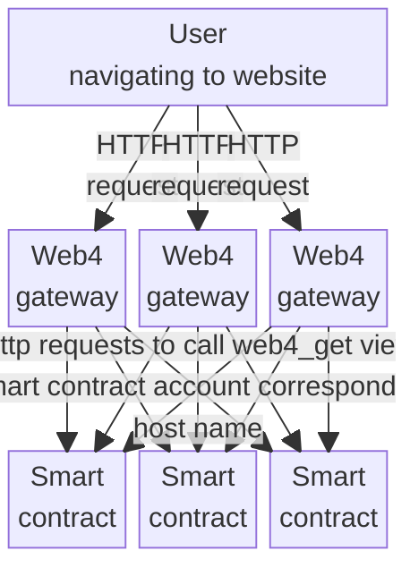
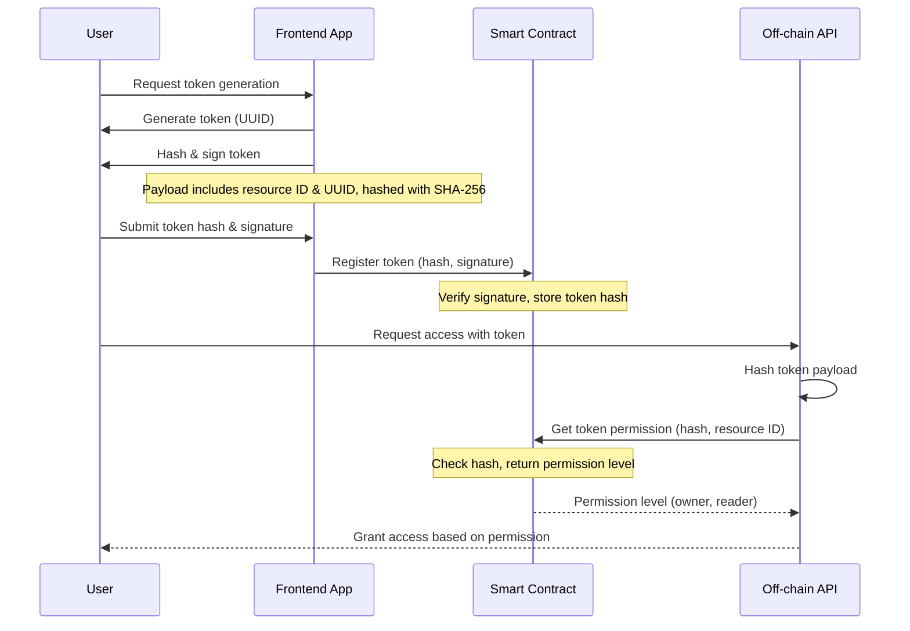

# Chapter 12: WebAssembly Smart Contracts on the NEAR Protocol Blockchain

# Introduction

For modern web applications, the requirements for information security are increasing. Confidentiality, integrity and availability are key requirements, and with that comes also auditability, access control and scalability. For developing and business critical web applications today, huge efforts are made to meet such non-functional requirements. A cloud-based web application often combines software components such as databases, identity frameworks, event streaming, logging solutions. In addition, the code written for integrating it all is a substantial piece of the application. This non-functional part of the code may be even larger than the actual functional code, that is responsible for the business logic of the app.

Blockchain technology provides many of these features out of the box, especially when it comes data integrity and availability. A distributed network of nodes ensures that the network is always available, and that there is a common consensus about the current state of the data. The distributed nature of blockchain allows it to scale with the workload, and the data change history can be tracked back to the very beginning. The blocks of transactions also function as a source of events, to be consumed by integrations and reporting tools. While blockchain focuses more on transparency than privacy, combining off-chain storage and on-chain cryptographic references, can be applied to comply with confidentiality requirements. Cryptographic access keys provide access control mechanisms out of the box.

With the evolution of smart contracts in blockchains like Ethereum, came the possibility of executing custom code on each transaction. These small programs, which can any blockchain user can write and deploy, opens up for using blockchain technology as an application platform. Just like any Function-as-a-Service cloud provider, a smart contract deployed on a blockchain can play the same role, and with all the non-functional information security requirements already built into the hosting infrastructure.

As a compact, fast starting and resource efficient executable binary format, WebAssembly is becoming increasingly popular for packaging and executing smart contract code. Blockchains that leverage WebAssembly for smart contracts are capable of executing code written in a variety of languages, to host many types of Web applications that we have normally been creating for cloud provider hosting.

In this chapter we will look at the NEAR protocol, which is a blockchain that demonstrates all of these features, providing a platform to serve WebAssembly applications at scale.

# Structure

- A minimal smart contract that says hello
  - Web4
- Storing data
- Smart Contracts written in Rust
- An app for managing access keys
    - Creating access tokens
    - Unit testing the smart contract
- A Javascript runtime inside a smart contract

# Objectives

In this chapter you will learn how to write and deploy WebAssembly smart contracts on the NEAR protocol blockchain. You will see how to create the smallest smart contract using pure WebAssembly Text Format, with a function that just returns a string, and also functions that write to and read from blockchain storage. After reading this chapter you should understand that the WebAssembly format on NEAR is no different than in the browser, or for WASI, but that it is just a different set of imported functions that are specific to the blockchain. We will go through more complex examples, where we look into using the Rust SDK for creating NEAR smart contracts. You will see how these kind of smart contracts has many similarities with deploying to "Function as a Service" cloud offerings, and that we can implement comprehensive functionality. We will demonstrate how to use the blockchain accounts as app users, where we manage API tokens through the smart contracts. To demonstrate the capability of embedding a large and complex library, you will see how to embed the QuickJS Javascript runtime inside a smart contract.

# A minimal smart contract that says hello

Let us start simple, using the WebAssembly Text format, to get an immediate understanding of how the NEAR blockchain is connected to WebAssembly.

Here is a smart contract with one function that returns the string "hello". Let us store this in a file that we name `minimal_contract.wat`.

```
(module
  (import "env" "value_return" (func $value_return (param i64 i64)))
  (func (export "hello")
    i64.const 7
    i64.const 0
    call $value_return
  )
  (memory 1)
  (data (i32.const 0) "\"hello\"")
)
```

We see that we import a function called `value_return`, which is provided by the NEAR Virtual Machine when executing the WebAssembly on the blockchain. `value_return` returns a result from the function, and it takes two parameters, which is the length of the result string, and the pointer to it in memory. The return value should be valid JSON, and so we wrap it in double quotation marks.

We can use a tool called `near-cli` to deploy our contract on the blockchain. Go to https://docs.near.org/tools/near-cli for installation instructions.

Once installed, we can create an account:

```bash
near create-account youraccount.testnet --useFaucet
```

Replace `youraccount` with a name of your choice, but keep the `.testnet` ending. When using the test network, we can also add the `--useFaucet` parameter so that we get testnet tokens for free. If using the main network, we would have to acquire NEAR tokens, but we don't need that to test our code, and demonstrate the functionality. The testnet has all the features of the mainnet, so that we can carefully test that our apps work as intended before deploying to production.

Now we can deploy our WebAssembly file to the newly created account. First let us convert it to wasm, using wat2wasm:

```bash
wat2wasm minimal_contract.wat
```

and then we can deploy it:

```bash
near deploy youraccount.testnet minimal_contract.wasm
```

Our smart contract is now on the blockchain, and we can call it using near-cli:

```bash
near view youraccount.testnet hello
```

Calling a "view method", using `near view` does not record any transaction on the blockchain. When we are only reading data, and not changing any state, the NEAR blockchain offers to call read-only functions on smart contracts without any transaction cost.

## Web4

We can utilize this to create a simple web page. Let us change our WebAssembly code a bit so that it returns content similar to what a web server would return.

```
(module
  (import "env" "value_return" (func $value_return (param i64 i64)))
  (func (export "web4_get")
    i64.const 63
    i64.const 0
    call $value_return
  )
  (memory 1)
  (data (i32.const 0) "{\"contentType\": \"text/html; charset=UTF-8\", \"body\": \"aGVsbG8K\"}")
)
```

Here you can see we export a function named `web4_get`, and we return a value with a JSON that contains the properties `contentType` and `body`. The `body` property contains a base64 encoded value, which in this case is the string `hello`.

Deploying this, and calling it using `near view` like above returns exactly that JSON string. What is interesting, is that it is now available as a web page, on the address https://youraccount.testnet.page. When opening that in the browser you see the string "hello" displayed on the page. With a minimum effort, we now have a web page deployed, available everywhere.

Serving web pages by calling a view method on the smart contract is done using a gateway, that works as a web server, but gets the content to serve by calling the view method `web4_get` on the smart contract that corresponds with the account name in the URL. The gateway used in this example is called "web4", which you can find at Vladimir Grichina's github page: https://github.com/vgrichina/web4. A gateway is already running to serve https://ACCOUNT_NAME.testnet.page for smart contracts deployed to testnet accounts, and https://ACCOUNT_NAME.near.page for mainnet accounts. The minimum requirement for this using this gateway, is that your smart contract implements a method called `web4`, that responds with a JSON as shown in the example.

The idea of web4 is experimental, but suggests a natural evolution of the distributed web. If we consider the somehow established definitions of web 1, 2 and 3, where web 1 was static informational content, web 2 introduced dynamic content and user interactions, and web 3 is about integrating with the blockchain for distributing data and transactions, the web 4 idea might be a natural next step. In addition to distributing data and user generated transactions across a blockchain network, web 4 introduce distributed hosting of web applications from smart contracts.

As shown in the diagram below, in web4, the user can send a request to any gateway host, which forward the request to the smart contract with an account name that corresponds to the host name.



# Storing data

The next step is to use the blockchain for storing data, and also invite users to our application. From the NEAR protocol environment, we can import all the functions needed to interact with the blockchain storage.

In the example below we import functions for storage and registers. Registers are placeholders in the NEAR virtual machine, for where data can fetched into memory from storage, before we copy it into the WebAssembly instance memory. This way we can inspect the register content length, so that we can prepare WebAssembly memory to receieve it.

The functionality in the example is for users to register when they visit the app, using the `visit` function. It is also possible to look up who was the last visitor by calling the `last_visitor` view function. The `visit` function will simply store the name of the account calling it, and the `last_visitor` function will return that stored value.

```
(module
  ;; params: value_len, value_ptr
  (import "env" "value_return" (func $value_return (param i64 i64)))
  ;; params: key_len, key_ptr, value_len, value_ptr, register_id
  (import "env" "storage_write" (func $storage_write (param i64 i64 i64 i64 i64) (result i64)))
  ;; params: key_len, key_ptr, register_id
  (import "env" "storage_read" (func $storage_read (param i64 i64 i64) (result i64)))
  ;; params: register, ptr
  (import "env" "read_register" (func $read_register (param i64 i64)))
  ;; params: register_id, result: len
  (import "env" "register_len" (func $register_len (param i64) (result i64)))
  ;; params: register_id
  (import "env" "signer_account_id" (func $signer_account_id (param i64)))
  (func (export "visit")    
    (call $signer_account_id (i64.const 0)) ;; read signer_account_id into register 0)
    (call $read_register (i64.const 0) (i64.const 2048))  ;; read register 0 contents into memory addr 2048
    (call $storage_write
      ( i64.const 7 ) ;; length of key named "visitor"
      ( i64.const 1024 );; address of key named "visitor"
      (call $register_len (i64.const 0)) ;; get length of contents in register 0
      ( i64.const 2048 ) ;; address that we stored registered 0 contents into
      ( i64.const 0 )
    )
    drop
  )
  (func (export "last_visitor")
    (call $storage_read
      ( i64.const 7 ) ;; length of key named "visitor"
      ( i64.const 1024 );; address of key named "visitor"
      ( i64.const 0 );; store result in register 0
    )
    (i32.store8 (i32.add (i32.const 2048) (i32.wrap_i64 (call $register_len (i64.const 0)))) (i32.const 34)) ;; store character " at memory addr 2048 + content length
    (call $read_register (i64.const 0) (i64.const 2048)) ;; read contents of register 0 into memory addr 2048
    drop
    (call $value_return (i64.add (i64.const 2) (call $register_len (i64.const 0))) (i64.const 2047)) ;; return value with 2 + length of register 0 contents, at memory addr 2047
  )
  (memory 1)  
  (data (i32.const 1024) "visitor") ;; blockchain storage key
  (data (i32.const 2047) "\"") ;; first character of returned result when calling "last_visitor"
)
```

Let us convert it to WebAssembly:

```bash
wat2wasm store_visitor.wat
```

and deploy it:

```bash
near deploy youraccount.testnet store_visitor.wasm
```

Now let us first call the `visit` function:

```bash
near call --accountId=visitioraccount.testnet youraccount.testnet visit
```

Replace `visitoraccount.testnet` with the account you want to be registered as visitor. This will also generate a transaction on the blockchain, which you can inspect by invoking the URL you see when running the command above.

Now that we have registered a visitor, we can also look it up by calling the `last_visitor` function.

```bash
near view youraccount.testnet last_visitor
```

You should see account you used for the `--accountId` flag when calling the `visit` function.

We are still using WebAssembly Text format here, to continue emphasizing that this is pure WebAssembly. It is the same type of WebAssembly binaries that can run in the browser, but just like WASI, the NEAR environment has a set of predefined imports to interact with the Blockchain. WAT does become complex and impractical to use beyond this, and so we will look into writing smart contracts in other languages that compile to WebAssembly.

# Smart Contracts written in Rust

Rust compiles to many targets, so WebAssembly is not the only one. For example, for the Solana blockchain you can use Rust for writing smart contracts, but it use BPF and not WebAssembly for execution. Berkeley Packet Filter (BPF) is oriented around extending the operating system, while WebAssembly is focused on running untrusted code in the user space.

We will here focus on Rust compiling to WebAssembly, which is what we use for smart contracts on the NEAR protocol blockchain.

In the previous examples we could see that writing WebAssembly Text format becomes comprehensive and complex, and so we can use Rust to work with more flexible and secure code. For NEAR protocol, there is also a Software Development Kit ( SDK ) for Rust which you can find at https://github.com/near/near-sdk-rs. It simplifies writing the smart contracts, and also provide a higher level interface where we for example don't need to interact directly with blockchain registers, as in the examples above.

Let us see what the "visitor" contract above looks like in Rust.

We create a Rust project with a Cargo.toml where we add `near-sdk` and `borsh` as dependencies:

```
[package]
name = "visitor_rust"
version = "0.1.0"
edition = "2021"

[lib]
crate-type = ["cdylib"]

[dependencies]
near-sdk = "5.0.0"

[profile.release]
lto = true
opt-level = 'z'
debug = false
strip = 'symbols'
```

Then we create our `src/lib.rs` file:

```rust
use near_sdk::borsh::{BorshDeserialize, BorshSerialize};
use near_sdk::{env, near_bindgen, AccountId};

#[near_bindgen]
#[derive(Default, BorshDeserialize, BorshSerialize)]
#[borsh(crate = "near_sdk::borsh")]
pub struct Visitor {
    visitor: Option<AccountId>
}

#[near_bindgen]
impl Visitor {
    pub fn visit(&mut self) {
        let _ = self.visitor.insert(env::signer_account_id());
    }

    pub fn last_visitor(&self) -> Option<AccountId> {
        self.visitor.to_owned()
    }
}
```

We build for the `wasm32-unknown-unknown` target:

```bash
cargo build --target=wasm32-unknown-unknown --release
```

And then we have a WebAssembly file that we can deploy:

```bash
near deploy youraccount.testnet target/wasm32-unknown-unknown/release/visitor_rust.wasm
```

We can use the same commands for calling the `visit` and `last_visitor` functions as we did for the WAT version above.

In the Rust version, we see that there is a `struct` that holds the data we store on the blockchain. Our implementation does simply change the value in this struct, and does not have to use the low level `storage_read` / `storage_write` functions as we did in the WAT example. We could also access these low level functions from Rust, but we rather choose to decorate `pub struct Visitor` and the `impl Visitor` with `#[near_bindgen]`, which will create the low level integration code and create exported functions on the WebAssembly binary. Note that in the WAT version above the exported functions does not take any parameters, nor do they return any value, but rather used the imported `value_return` function for returning the result. By using `#[near_bindgen]` we can implement our functions with parameters and a return value, and the generated Wasm will be instrumented with `env.value_return` and `env.input` for returning values and mapping the input parameter values to the Rust function.

The use of `borsh` with the `BorshDeserialize` and `BorshSerialize` decorators, let us create and store complex data structures in a convenient way. `borsh` is a highly efficient binary serializer and deserializer. While the NEAR protocol storage is a simple key/value store, we can utilize `borsh` and the structs of the `near_sdk::collections` module to implement more complex storage structures.

# An app for managing access keys

In the world of distributed apps we create access keys with limited scope and lifetime. We can use a smart contract for storing and managing these. Since the blockchain is public, and all data stored there is accessible to anyone, we should only manage keypairs, and only store the public key on chain. For managing access keys, we can create a data structure where that maps the resource id to a set of public keys and their permissions.

The example in this section is based on the smart contract implemented for managing permissions to git repositories hosted by the `githttpserver` project which you can find at https://github.com/petersalomonsen/githttpserver/. We did also briefly look at this project in chapter 6, for authenticating with the git server.

Let us create a new Rust project that we call `access_key_management_rust`. We can copy the `Cargo.toml` file from the previous example, but just modify the name.

We will then create this `src/lib.rs` file:

```rust
use std::collections::HashMap;

use near_sdk::borsh::{BorshDeserialize, BorshSerialize};
use near_sdk::env::signer_account_id;
use near_sdk::store::LookupMap;
use near_sdk::{env, near_bindgen, AccountId, NearToken, PanicOnDefault};

#[derive(BorshDeserialize, BorshSerialize, PartialEq, Clone)]
#[borsh(crate = "near_sdk::borsh")]
pub enum Permission {
    Owner,
    Contributor,
    Reader,
}

#[near_bindgen]
#[derive(PanicOnDefault, BorshDeserialize, BorshSerialize)]
#[borsh(crate = "near_sdk::borsh")]
pub struct AccessKeyManagement {
    resources: LookupMap<String, HashMap<AccountId, Permission>>,
}

#[near_bindgen]
impl AccessKeyManagement {
    #[init(ignore_state)]
    pub fn init() -> Self {
        let contract = Self {
            resources: LookupMap::new(b"r".to_vec()),
        };
        contract
    }

    #[payable]
    pub fn register_resource(&mut self, resource_id: String) {
        if env::attached_deposit() != NearToken::from_millinear(100) {
            env::panic_str("You must deposit 0.1 NEAR to register a resource");
        }
        if self.resources.contains_key(&resource_id) {
            env::panic_str("Resource already exists");
        }
        let mut access_map: HashMap<AccountId, Permission> = HashMap::new();
        access_map.insert(env::signer_account_id(), Permission::Owner);
        self.resources.insert(resource_id, access_map);
    }

    pub fn grant_permission_to_resource(
        &mut self,
        resource_id: String,
        account_id: AccountId,
        permission: String,
    ) {
        let mut resource = self.resources.get(&resource_id).unwrap().clone();
        if resource.get(&signer_account_id()).unwrap().clone() != Permission::Owner {
            env::panic_str("Must be owner to grant permissions to resource");
        }
        resource.insert(
            account_id,
            match permission.as_str() {
                "owner" => Permission::Owner,
                "contributor" => Permission::Contributor,
                "reader" => Permission::Reader,
                _ => env::panic_str("Unknown permission type"),
            },
        );
        self.resources.insert(resource_id, resource);
    }

    pub fn get_permission_for_resource(
        &self,
        resource_id: String,
        account_id: AccountId,
    ) -> String {
        match self
            .resources
            .get(&resource_id)
            .unwrap()
            .get(&account_id)
            .unwrap()
            .clone()
        {
            Permission::Owner => "owner".to_string(),
            Permission::Contributor => "contributor".to_string(),
            Permission::Reader => "reader".to_string(),
        }
    }
```

This example shows how to store data for a large number of records. In the `LookupMap` named `resources` we store a `HashMap` with permissions for every registered resource. We have the function `register_resource` for registering new resources. The caller will immediately become the owner of the resource, but it will only be registered if it does not already exist. In this function we also demonstrate how to require a payment for calling this function, which is done by adding the `#[payable]` decorator, and checking the attached amount by calling `env::attached_deposit()`. The NEAR blockchain provides functionality for refunding the payment if the function call fails for some reason ( for example if the resource already exists ), so we can our code can focus on the specific functional requirements. The blockchain is taking care of fundamental features that we would take for granted, such as refunding on failure.

Let us build the WebAssembly binary for the contract:

```bash
cargo build --target=wasm32-unknown-unknown --release
```

And deploy it:

```bash
near deploy youraccount.testnet target/wasm32-unknown-unknown/release/access_key_management_rust.wasm
```

Before starting to use the contract, we need to call the `init` function which will set up the `LookupMap` for the resources. Note the parameter to `LookupMap::new` which is just a single character `r`. This will be the prefix for resource storage keys. The prefix should be unique, and as short as possible to save space. Storage is a significant cost element on the blockchain. The pricing model is different from cloud storage, in the sense that you reserve an amount for the storage you are occupying, which you will get refunded if you remove the data.

Let us call the `init` function:

```bash
near call --accountId=youraccount.testnet youraccount.testnet init
```

And register our first resource by calling the `register_resource` function:

```bash
near call --accountId=youraccount.testnet youraccount.testnet register_resource '{"resource_id": "mytestresource"}' --deposit=0.1
```

Since the `--accountId` flag is set to `youraccount.testnet`, the owner of the resource named `mytestresource` will be `youraccount.testnet`.

We can verify this by calling the view method `get_permission_for_resource`:

```bash
near view youraccount.testnet get_permission_for_resource '{"resource_id": "mytestresource", "account_id": "youraccount.testnet"}'
```

And we should get a result that says `owner`.

We should also try the `grant_permission_to_resource` function, which lets us add multiple accounts with different permissions to a resource. Let us grant the `reader` permission to the account named `anotheraccount.testnet`:

```bash
near call --accountId=youraccount.testnet youraccount.testnet grant_permission_to_resource '{"resource_id": "mytestresource", "account_id": "anotheraccount.testnet", "permission": "reader"}'
```

If we call the view method `get_permission_for_resource by typing the command:

```bash
near view youraccount.testnet get_permission_for_resource '{"resource_id": "mytestresource", "account_id": "anotheraccount.testnet"}'
```

Then we can see that we get the result `reader`.

## Creating access tokens

Now that we have an app to create a store of accounts and their permissions to resources, we would also like to be able to create access tokens that can be verified by other apps. For example, for accessing a server like the git server mentioned in chapter 6, the client application would need to pass an access token that the git server should be able to verify, and also trust the issuer. We can let the end user generate and sign their own access tokens, but then the server needs to be able to verify that the signing key belongs to the user, and that the user has permission to the requested resource.

Let us create a simple way of storing access token hashes on chain, with a verification that the token is signed by the account that registers it.

We start by adding another `LookupMap` that we name `tokens` to our `AccessKeyManagement` struct:

```rust
pub struct AccessKeyManagement {
    resources: LookupMap<String, HashMap<AccountId, Permission>>,
    tokens: LookupMap<Vec<u8>, AccountId>,
}
```

This lookup map will store `sha256` hashes of access tokens generated by the user, with the account id that register the token.

Since we are modifying our storage data structure, we would also need to adjust our `init` function:

```rust
    #[init(ignore_state)]
    pub fn init() -> Self {
        let contract = Self {
            resources: LookupMap::new(b"r".to_vec()),
            tokens: LookupMap::new(b"t".to_vec()),
        };
        contract
    }
```

Note that we add the `ignore_state` parameter to the `#[init]` decorator, since we want to be able to call the `init` function even though the contract has already been initialized earlier. The `init` function will now also add the `tokens` map, with the prefix `t`. Since we are only registering lookup map storage prefixes, we will not overwrite any data by calling this `init` function, and so we do not have to provide any complex migration logic for this particular use case.

Finally we will add two more functions:

```rust
    pub fn register_token(&mut self, token_hash: Vec<u8>, signature: Vec<u8>) {
        let mut pk_array: [u8; 32] = [0u8; 32];
        pk_array.copy_from_slice(&env::signer_account_pk().as_bytes()[1..33]);

        if !env::ed25519_verify(
            signature.as_slice().try_into().unwrap(),
            token_hash.as_slice(),
            &pk_array,
        ) {
            env::panic_str("Invalid token signature");
        }
        self.tokens
            .insert(token_hash.to_vec(), env::signer_account_id());
    }

    pub fn get_token_permission_for_resource(
        &self,
        token_hash: Vec<u8>,
        resource_id: String,
    ) -> String {
        let account_id = self.tokens.get(token_hash.as_slice()).unwrap().clone();
        return self.get_permission_for_resource(resource_id, account_id);
    }
```

The `register_token` function receives the SHA256 hash of the token payload in the `token_hash` parameter, which is generated by the client. The token payload is never shared with the smart contract, since we don't want anyone else than the end user to be able to use the token. The `signature` parameter is also created on the client by signing the SHA256 hash of the token payload. By providing this to the `register_token` function, the smart contract can verify that the token was indeed signed by the caller account. This verification is done by calling the `ed25519_verify` function, that is provided with the token hash, signature and the public key used to sign the transaction for calling the `register_token` function.

After a token is verified and registered, the end user can call a another service, for example a web API, that can check with the smart contract if the user has access. The user will send the full token payload to this other API, where the API server will hash it, and call the `get_token_permission_for_resource` function in the smart contract to ask for the permission for the token hash to the given resource.

We do also need to create a frontend, where the token payload will be created, and from where the smart contract will be called for registering the token, and that also calls an off chain API which checks the token's permission.

Here is a sequence diagram showing the flow between the user, frontend application, smart contract and off chain API:



Let us create a simple web frontend in a file that we call `app.html`:

```html
<!DOCTYPE html>
<html>
<head>
    <meta charset="UTF-8">
    <meta name="viewport" content="width=device-width, initial-scale=1.0">
</head>
<body>
    <div>
        <button id="signin_button">Sign in</button>
        <button id="signout_button">Sign out <span id="signedin_account_span"></span></button>
        <button id="generate_token_button">Generate token</button>
        <button id="register_token_button">Register token</button>
        <button id="call_offchain_api_button">Call off-chain API</button>
    </div>
    <h3>Result</h3>
    <pre><code id="resultarea"></code></pre>
</body>
<script src="https://cdn.jsdelivr.net/npm/near-api-js@3.0.4/dist/near-api-js.min.js"></script>
<script type="module">
    const contractId = 'youraccount.testnet';
    const near = await nearApi.connect({
        networkId: 'testnet',
        keyStore: new nearApi.keyStores.BrowserLocalStorageKeyStore(),
        contractId,
        nodeUrl: 'https://rpc.testnet.near.org',
        walletUrl: 'https://testnet.mynearwallet.com/'
    });

    const walletConnection = new nearApi.WalletConnection(near, 'my-app');
    const signInButton = document.getElementById('signin_button');
    const signoutButton = document.getElementById('signout_button');
    const signedInAccountSpan = document.getElementById('signedin_account_span');
    const generateTokenButton = document.getElementById('generate_token_button');
    const registerTokenButton = document.getElementById('register_token_button');
    const callOffchainAPIButton = document.getElementById('call_offchain_api_button');
    const resultArea = document.getElementById('resultarea');

    if (await walletConnection.isSignedInAsync()) {
        signInButton.style.display = 'none';
        signoutButton.style.display = 'block';
        signedInAccountSpan.innerHTML = walletConnection.getAccountId();
    } else {
        signInButton.style.display = 'block';
        signoutButton.style.display = 'none';
    }

    signInButton.addEventListener('click', async () => {
        await walletConnection.requestSignIn({ contractId });
    });
    signoutButton.addEventListener('click', async () => {
        await walletConnection.signOut();
        signInButton.style.display = 'block';
        signoutButton.style.display = 'none';
    });

    const resource_id = 'mytestresource';
    let token_bytes;

    generateTokenButton.addEventListener('click', async () => {
        const token_uuid = crypto.randomUUID();
        const token_string = JSON.stringify({ resource_id, token_uuid });
        token_bytes = new TextEncoder().encode(token_string);
        resultArea.innerText = token_string;
    });

    registerTokenButton.addEventListener('click', async () => {
        registerTokenButton.disabled = true;
        try {
            resultArea.innerText = 'Please wait while registering token';
            const signature = Array.from((await near.connection.signer.signMessage(token_bytes, walletConnection.getAccountId(), 'testnet')).signature);
            const token_hash = Array.from(new Uint8Array(await crypto.subtle.digest("SHA-256", token_bytes)));

            const contract = new nearApi.Contract(walletConnection.account(), contractId, {
                changeMethods: ['register_token']
            });

            const result = await contract.register_token({ token_hash, signature });
            resultArea.innerText = JSON.stringify(result, null, 1);
        } catch (e) {
            resultArea.innerText = e.toString();
        }
        registerTokenButton.disabled = false;
    });

    callOffchainAPIButton.addEventListener('click', async () => {
        const token_bytes_base64 = btoa(Array.from(token_bytes, (byte) =>
            String.fromCodePoint(byte),
        ).join(""));
        resultArea.innerText = await fetch('/api', { headers: { Authorization: `Bearer ${token_bytes_base64}` } }).then(r => r.text());
    });
</script>
</html>
```

This HTML code will display a web page with buttons for signing in, generating a token, registering the token, and calling the off-chain API as you can see in the image below.


In the HTML and Javascript code, you can see that we are loading the library `near-api-js`, which is a Javascript library for interacting with the NEAR blockchain. We are configuring it to access the test network. Clicking the "sign in" button will take us to a "Wallet", where we can also create accounts. On the test network, you can create any account, and for using this example you should also call the `grant_permission_to_resource` function as we did above, to your newly created account.

Before we go further, we should also create a simple server to host the "off-chain" API that will use our smart contract for access control. Here is such a server written for nodejs:

```javascript
import { createServer } from 'node:http';
import { readFile } from 'node:fs/promises';
import nearApi from 'near-api-js';

const contractId = 'youraccount.testnet';
const near = await nearApi.connect({
    networkId: 'testnet',
    contractId,
    nodeUrl: 'https://rpc.testnet.near.org'
});

const server = createServer(async (req, res) => {
    if (req.url == '/api') {
        const token_bytes = Buffer.from(req.headers.authorization.substring('Bearer '.length), 'base64');
        const token_payload = JSON.parse(new TextDecoder().decode(token_bytes));
        const token_hash = Array.from(new Uint8Array(await crypto.subtle.digest("SHA-256", token_bytes)));

        const contract = new nearApi.Contract(await near.account(), 'youraccount.testnet', {
            viewMethods: ['get_token_permission_for_resource']
        });

        try {
            const permission = await contract.get_token_permission_for_resource({ token_hash, resource_id: token_payload.resource_id });
            res.write(`Your permission to ${token_payload.resource_id} is: ${permission}`);
        } catch (e) {
            res.write(e.toString());
        }
        res.end();
    } else {
        res.write(await readFile('app.html'));
        res.end();
    }
});
server.listen(15000);
```

Note that this server will also host the `app.html`, so if you run this, and navigate the browser to http://localhost:15000, you will see our frontend application. This server code also checks the incoming request to contain the URL `/api`, in which case it will get the token passed in the `authorization` header, and call the smart contract for checking the permission. As you can see it receives the full token payload, and hashes it, before it asks the smart contract for the permission.

Given that we have signed in, generated a token, registered the token, and finally called the off-chain API we should see a result like from the screenshot below:


## Unit testing the smart contract

When writing critical and potentially vulnerable logic like access control, it is important to have full test coverage. In Rust, writing unit tests is a low hanging fruit, since we can easily insert them almost anywhere in our codebase. We should always write tests while coding the functionality. If developing the habit of coding test-driven, it is very rare that you have to start the application for testing your changes. Instead, while coding, you switch between running the tests and making adjustments.

The Rust `near-sdk` also comes with testing tools, so that you can simulate a blockchain context. You can imitate to executing the contract under a given account, set the attached deposits and more.

To enable the unit testing feature for `near-sdk` we have to add it to our dependency declaration in `Cargo.toml`:

```
[dependencies]
near-sdk = {version = "5.0.0", features = ["unit-testing"]}
```

Here we add the `unit-testing` feature to our `near-sdk` dependency, and we are ready to add unit tests.

Let us append the following test code to `src/lib.rs`:

```rust
#[cfg(test)]
pub mod tests {
    use near_sdk::{
        test_utils::{accounts, VMContextBuilder},
        testing_env,
    };

    use super::*;

    #[test]
    fn test_register_resource() {
        testing_env!(VMContextBuilder::new()
            .signer_account_id(accounts(0))
            .attached_deposit(NearToken::from_millinear(100))
            .build());

        let mut contract = AccessKeyManagement::init();
        contract.register_resource("testresource".to_string());
        assert_eq!(
            "owner",
            contract.get_permission_for_resource("testresource".to_string(), accounts(0))
        );
    }

    #[test]
    fn test_grant_permission_to_resource() {
        testing_env!(VMContextBuilder::new()
            .signer_account_id(accounts(0))
            .attached_deposit(NearToken::from_millinear(100))
            .build());

        let mut contract = AccessKeyManagement::init();
        const RESOURCE_ID: &str = "testresource2";
        contract.register_resource(RESOURCE_ID.to_string());
        contract.grant_permission_to_resource(
            RESOURCE_ID.to_string(),
            accounts(1),
            "reader".to_string(),
        );
        assert_eq!(
            "reader",
            contract.get_permission_for_resource(RESOURCE_ID.to_string(), accounts(1))
        );
        testing_env!(VMContextBuilder::new()
            .signer_account_id(accounts(1))
            .build());
        let result = std::panic::catch_unwind(std::panic::AssertUnwindSafe(|| {
            contract.grant_permission_to_resource(
                RESOURCE_ID.to_string(),
                accounts(2),
                "contributor".to_string(),
            )
        }));

        assert!(result.is_err());
        if let Err(err) = result {
            if let Some(panic_msg) = err.downcast_ref::<String>() {
                assert!(panic_msg.contains("Must be owner to grant permissions to resource"));
            } else {
                panic!("Unexpected panic message type.");
            }
        }
    }
}
```

Here we have declared a test module, and each test function use the `testing_env` macro to set up a blockchain context. The context is initialized with an account, from the list of predefined test accounts provided by `near-sdk::test_utils::accounts`, and in the first test `test_register_resource`, we also attach a deposit of 0.1 NEAR. In this first test, we register a resource, and verify that the caller account has owner permission after registration.

In the second test `test_grant_permission_to_resource`, we first start registering the resource with the first account. Then we grant permission to the second account, and verify that it has got the `reader` permission. After that we create a new context, making the second account the caller, and try to grant permission to the resource to the third account. We expect this to fail since the second account does not have `owner` permission.

Rust unit tests are powerful, easily accessible, and you should use them to test any edge case of your intended functionality. Not only does it raise confidence in that execution of the smart contract will give consistent results, but also reduce the risk of  introducing bugs in existing functionality when making future changes.

You can also automate tests on the integration level using `near-workspaces-rs` which you can find at https://github.com/near/near-workspaces-rs. This is useful to cover behavior that you cannot test with unit tests, such as for example upgrading a contract with changes in the data structure. "Cross-contract" calls is another feature where you need to test on the integration layer, and also here you may find `near-workspaces-rs` useful.

# A Javascript runtime inside a smart contract

Ethereum smart contracts, which are not packaged as WebAssembly, but rather the Ethereum-specific language and bytecode named "Solidity", have a maximum size of 24kb. This sets some limititations of what kind of applications we can create, compared to the possibilities with WebAssembly smart contracts on NEAR protocol. On NEAR protocol the maximum contract size is 4 MB, which opens up for creating quite advanced applications to run on the blockchain. With this kind of capacity, we can even embed QuickJS that we looked at in chapter 8. We can have Javascript running on the blockchain.

The JSinRust project which you can find at https://github.com/petersalomonsen/quickjs-rust-near, shows how to embed QuickJS inside a Rust smart contract. Since QuickJS is written in C, it is most straight forward to write some higher level APIs in C for integrating it with Rust, just as we saw in chapter 7 with the simple `jseval` library. Hence, we will here show how to create a smart contract in C which is embedding QuickJS to run a simple Javascript program.

The downside when writing a smart contract in C, is that there is no SDK like we have for Rust. We have to write all the low-level blockchain operations, just as we did with the WAT smart contracts earlier in this chapter.

We will now look at a smart contract implementation in C, that lets the caller upload Javascript code which should return a Web4 response object.

The first part of the code is for defining global objects and external functions that we expect to be provided as WebAssembly imports from the NEAR protocol environment.

```c
#include "./quickjs-2024-01-13/quickjs.h"
#include <string.h>
#include <stdlib.h>
#include <stdint.h>
#include <wasi/api.h>

JSValue global_obj;
JSRuntime *rt = NULL;
JSContext *ctx;

static const char b64_table[] = "ABCDEFGHIJKLMNOPQRSTUVWXYZabcdefghijklmnopqrstuvwxyz0123456789+/";
static const char STORAGE_KEY[] = "j";
const int64_t STORAGE_KEY_LEN = 1;

extern void value_return(int64_t value_len, int64_t value_ptr);
extern void input(int64_t register_id);
extern void read_register(int64_t register_id, int64_t data_ptr);
extern int64_t register_len(int64_t register_id);
extern int64_t storage_write(int64_t key_len, int64_t key_ptr, int64_t value_len, int64_t value_ptr, int64_t register_id);
extern int64_t storage_read(int64_t key_len, int64_t key_ptr, int64_t register_id);
extern int64_t block_timestamp();
extern int64_t block_index();

```

The next part is mostly about mocking WASI functions that are referenced as a result of code interacting with the operating systems. Most of these functions are not in use as long as the Javascript code we upload does not invoke file operations for example. We can implement the WASI time function though, since we have the `block_timestamp` from the imported environment.

```c
__wasi_errno_t __wasi_clock_time_get(__wasi_clockid_t id, __wasi_timestamp_t precision, __wasi_timestamp_t *time)
{
    *time = block_timestamp();
    return 0;
}

__wasi_errno_t __wasi_fd_close(__wasi_fd_t fd)
{
    return 0;
}
__wasi_errno_t __wasi_environ_sizes_get(__wasi_size_t *environ_count, __wasi_size_t *environ_buf_size)
{
    return 0;
}
__wasi_errno_t __wasi_fd_write(
    __wasi_fd_t fd,
    const __wasi_ciovec_t *iovs,
    size_t iovs_len,
    __wasi_size_t *nwritten)
{
    return 0;
}

__wasi_errno_t __wasi_fd_seek(__wasi_fd_t fd, __wasi_filedelta_t offset, __wasi_whence_t whence, __wasi_filesize_t *newoffset)
{
    return 0;
}
void __wasi_proc_exit(__wasi_exitcode_t rval)
{
    abort();
}

__wasi_errno_t __wasi_environ_get(uint8_t **environ, uint8_t *environ_buf)
{
    return 0;
}
```

Now we have come to the part where we create the Javascript runtime environment. We do also provide some extra functions that can be used from Javascript which are `base64_encode` and `block_index`. In this section we also have the function for running Javascript code from a string.

```c
void base64_encode(const char *data, char *encoded)
{
    int i, j;
    size_t len = strlen(data);
    for (i = 0, j = 0; i < len; i += 3, j += 4)
    {
        int s = (data[i] << 16) + (((i + 1) < len) ? (data[i + 1] << 8) : 0) + (((i + 2) < len) ? data[i + 2] : 0);

        encoded[j] = b64_table[(s >> 18) & 0x3F];
        encoded[j + 1] = b64_table[(s >> 12) & 0x3F];
        encoded[j + 2] = ((i + 1) < len) ? b64_table[(s >> 6) & 0x3F] : '=';
        encoded[j + 3] = ((i + 2) < len) ? b64_table[s & 0x3F] : '=';
    }
    encoded[j] = '\0';
}

static JSValue js_base64_encode(JSContext *ctx, JSValueConst this_val, int argc, JSValueConst *argv)
{
    size_t len;
    const char *str = JS_ToCStringLen(ctx, &len, argv[0]);
    char *encoded = malloc((strlen(str) * 4) / 3);
    base64_encode(str, encoded);
    JS_FreeCString(ctx, str);
    JSValue js_string = JS_NewString(ctx, encoded);
    free(encoded);
    return js_string;
}

static JSValue js_block_index(JSContext *ctx, JSValueConst this_val, int argc, JSValueConst *argv)
{
    return JS_NewBigInt64(ctx, block_index());
}

void js_add_global_function(const char *name, JSCFunction *func, int length)
{
    JS_SetPropertyStr(ctx, global_obj, name, JS_NewCFunction(ctx, func, name, length));
}

void create_runtime()
{
    if (rt != NULL)
    {
        return;
    }
    rt = JS_NewRuntime();
    ctx = JS_NewContextRaw(rt);
    JS_AddIntrinsicBaseObjects(ctx);
    JS_AddIntrinsicDate(ctx);
    JS_AddIntrinsicEval(ctx);
    JS_AddIntrinsicStringNormalize(ctx);
    JS_AddIntrinsicRegExp(ctx);
    JS_AddIntrinsicJSON(ctx);
    JS_AddIntrinsicProxy(ctx);
    JS_AddIntrinsicMapSet(ctx);
    JS_AddIntrinsicTypedArrays(ctx);
    JS_AddIntrinsicBigInt(ctx);

    global_obj = JS_GetGlobalObject(ctx);
    js_add_global_function("block_index", &js_block_index, 0);
    js_add_global_function("base64_encode", &js_base64_encode, 1);
}

JSValue js_eval(const char *source)
{
    create_runtime();
    int len = strlen(source);
    JSValue val = JS_Eval(ctx,
                          source,
                          len,
                          "",
                          JS_EVAL_TYPE_GLOBAL);
    return val;
}
```

The two final functions are those that we can invoke from the outside. Through a blockchain transaction, we can invoke `store_js` to store javascript code into the smart contract storage. As a read-only function, or a "view method", we can invoke `web4_get` to get the HTML contents to be rendered in a web browser.

```c
void store_js()
{
    input(0);
    const char *scriptbuffer = malloc(register_len(0));
    read_register(0, (int64_t)scriptbuffer);
    storage_write(STORAGE_KEY_LEN, (int64_t)STORAGE_KEY, register_len(0), (int64_t)scriptbuffer, 0);
}

void web4_get()
{
    storage_read(STORAGE_KEY_LEN, (int64_t)STORAGE_KEY, 0);
    const char *scriptbuffer = malloc(register_len(0));
    read_register(0, (int64_t)scriptbuffer);
    JSValue result = js_eval(scriptbuffer);
    JSValue stringified_result = JS_JSONStringify(ctx, result, JS_NULL, JS_NewInt32(ctx, 1));
    const char *result_string = JS_ToCString(ctx, stringified_result);
    value_return(strlen(result_string), (int64_t)result_string);
}
```

You can find the whole code in the repository attached to this book.

In addition to the code of the C library we created for QuickJS in chapter 8, this integrates with imported NEAR blockchain environment functions. You can see the references to `value_return`, `input` for reading function call parameter, which in this case will be used for reading script contents the contract user will pass when calling the `store_js` function. In addition to the register and storage functions, it is worth mentioning `block_timestamp` which we will expose to QuickJS the scripts to be able to create a `Date` object. This we can do by simply implementing the `__wasi_clock_time_get` function, since QuickJS will use WASI interfaces for system interaction. Also `block_index`, which we expose as a function directly in QuickJS, which returns the "block height".

The rest of the WASI functions we mock, so any JavaScript code that leads to an invocation of these will not work, unless we provide some proper implementation. A good exercise would be to attempt implementing `__wasi_fd_write` to call the NEAR `log_str` function in case the file descriptor is `stdout`.

We also add a function here for base64 encoding, that we also expose to the Javascript engine, so that it is possible for the script to return a base64 encoded response body when the user calls `web4_get`.

The exported functions, that will be available to call by users is `store_js` and `web4_get`. The user can upload the script to be executed when calling the `web4_get` as a view function call. As we saw earlier, the `web4_get` function is used by the web4 gateway we demonstrated above, and so a running instance of the web4 gateway will be able to serve a web page from the result of the stored script.

Given we have already built `libquickjs.a`, which we did in chapter 8, we can compile our contract like this:

```bash
emcc -sERROR_ON_UNDEFINED_SYMBOLS=0 -sEXPORTED_FUNCTIONS=_store_js,_web4_get -Oz --no-entry libquickjs.a quickjs_contract.c -o quickjs_contract.wasm
```

This gives us a WebAssembly file named `quickjs_contract.wasm`, that we can deploy. Here is an example of deploying to an account named `wasmbook.testnet`:

```bash
near deploy wasmbook.testnet quickjs_contract.wasm
```

To use it, we first need to upload a script. Here is a simple Javascript code that will return the HTML contents for a web page inside a web4 response structure:

```javascript
const currentTime = new Date();

const html = `<!DOCTYPE html>
<html>
<head>
    <meta charset="UTF-8">
    <meta name="viewport" content="width=device-width, initial-scale=1.0">
</head>
<body>
<h1>Hello from QuickJS inside a NEAR smart contract!</h1>
<p>On the blockchain, the current time is ${currentTime} and the current number of blocks processed is ${block_index()}.</p>
</body>
</html>
`;

({"contentType": "text/html; charset=UTF-8", "body": base64_encode(html)});
```

The last line contains the result that will be the contents of the `result` variable inside the `web4_get` function, on the line with the code `JSValue result = js_eval(scriptbuffer);`.

If we save this to a file named `test.js`, we can base64 encode it and upload it:

```bash
SCRIPT_BASE64=`cat test.js| base64`
near call wasmbook.testnet --accountId=wasmbook.testnet store_js --base64 $SCRIPT_BASE64
```

Finally we can call the `web4_get` function with a `view` call:

```bash
near view wasmbook.testnet web4_get
```

This returns a JSON object with the `contentType` and `body` fields, where the `body` is the base64 encoded HTML code generated in the script we sent as a parameter when calling `store_js` above.

What is interesting is that if we now navigate to the URL of a web4 gateway, for example https://wasmbook.testnet.page (replace `wasmbook` with the account you deployed the contract to), we can see the following result in the browser:


Note that the `store_js` function now allows any user to upload scripts. Allowing anyone to modify the contents of a web page might be unfortunate, and a good exercise would be to secure the function to check which user that is calling it. This can be done by also importing the `signer_account_id` from the NEAR environment, and checking that it matches a specified user.

# Conclusion

We have seen that a smart contract on NEAR protocol is real WebAssembly, and that it can have complex and comprehensive logic. We started with the WebAssembly Text Format, to understand the interaction with the blockchain on a low level. Since WebAssembly smart contracts are much like a function deployed to a cloud or edge hosting service, it can also be used for serving web pages through a gateway, and we used the web4 gateway for this purpose. While Web3 is about using the blockchain for transactions, Web4 adds the possibility of serving web pages from smart contracts. We saw how we can use a smart contract for managing access keys and permissions for an off-chain web API, and verifying and storing acccess tokens generated and signed by the end user. The capability of running WebAssembly binaries of 4MB size enables us to embed QuickJS, and execute Javascript inside a smart contract, which we used to serve a web4 page.

A key part of "Green Technology" is to save energy, and WebAssembly allows this with its fast startup times. Because it starts fast, we can also shut it down when not in use. This is what happens on the NEAR protocol blockchain. There is nothing running idle, the Wasm binary is only instantiated when requested for a transaction or calling a view function. In the next chapter we will look into another WebAssembly hosting platform. Traditional Docker containers running on Kubernetes are often running idle, occupying memory and nodes while waiting for API requests. WebAssembly containers can change this. Kubernetes pods running Wasm containers can start fast, and shut down when not in use. WebAssembly on Kubernetes is a new chapter in Cloud Native technology opening up for more efficient utilization of compute resources.

# Points to remember

- We can deploy standard WebAssembly binaries as smart contracts on NEAR protocol
- With Rust there is an SDK providing more higher level interactions with the blockchain environment, and also facilitating testing
- Automated test coverage is crucial for maintaining smart contract code, and keeping it secure and consistent
- We can implement complex applications inside smart contracts on a blockchain that use WebAssembly like NEAR
- Embedding a Javascript runtime inside a smart contract, opens up for the end user to customize logic and behavior
- By applying a web gateway like web4, we can use smart contract view method calls to respond with HTML content to web requests.

# Exercises

- Secure the `store_js` function so that it only allows selected users to upload and store scripts
- implement the WASI `fd_write` function to call `log_str` on the NEAR environment