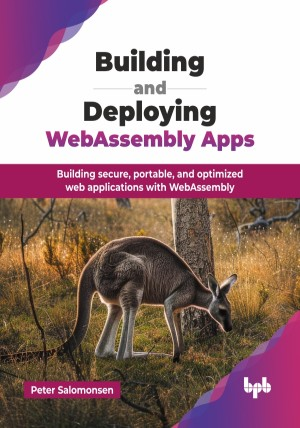

# Building and Deploying WebAssembly Apps

Building secure, portable, and optimized web applications with WebAssembly.

This is the repository for [Building and Deploying WebAssembly Apps
](https://bpbonline.com/products/building-and-deploying-webassembly-apps?variant=44404828143816),published by BPB Publications.

## About the Book
WebAssembly is a groundbreaking technology that has transformed the way we build and deploy web applications. It enables lightning-fast performance, portability across platforms, and seamless integration with existing web technologies. This comprehensive guide will lead you through the journey of mastering WebAssembly, from its fundamentals to advanced applications.

This book introduces WebAssembly basics, its purpose, and real-world use cases in web, server, and desktop apps. Featuring examples in languages like AssemblyScript, C/C++, and Rust, it covers converting legacy codebases to WebAssembly for browser compatibility. It showcases advanced use cases like WebAssembly-based music tools, Git integration, and smart contracts. The book concludes with WebAssembly's role in cloud-native Kubernetes, signaling a new era in container orchestration. Many of the examples build on the author's experience with WebAssembly Music, git in WebAssembly, and NEAR protocol smart contracts. These examples serve as real-world use cases, more than just a basic introduction to the technology.

By the end of this book, you will have gained the knowledge and skills to confidently build, deploy, and optimize high-performance WebAssembly applications across a wide range of platforms and use cases.

## What You Will Learn
• Understand the basics, purpose, and opportunities it unlocks.

• WebAssembly code fundamentals with low-level binary code through the WebAssembly Text Format.

• Discover how to compile languages like AssemblyScript, C/C++, and Rust into WebAssembly.

• Explore porting older C/C++ codebases into WebAssembly for modern applications.

• Learn about WebAssembly for sound, music, smart contracts, and Kubernetes container orchestration.
